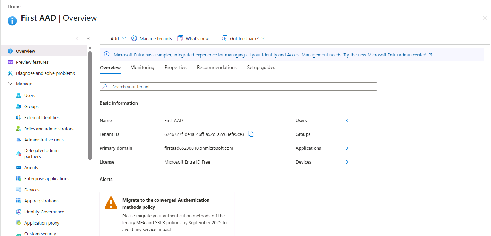
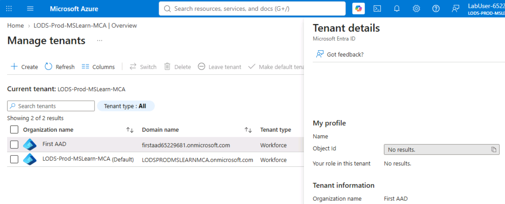
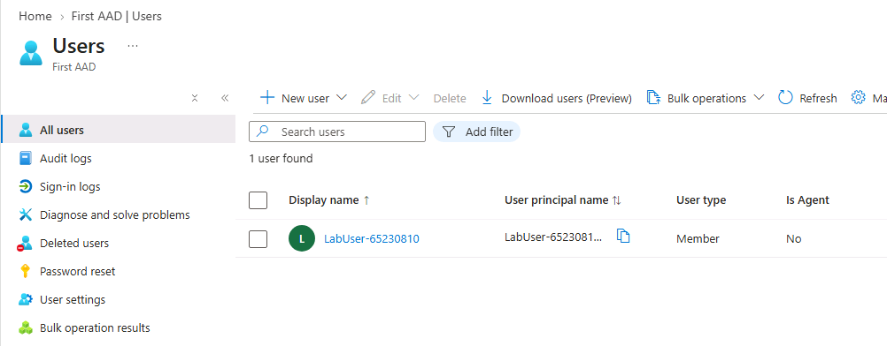
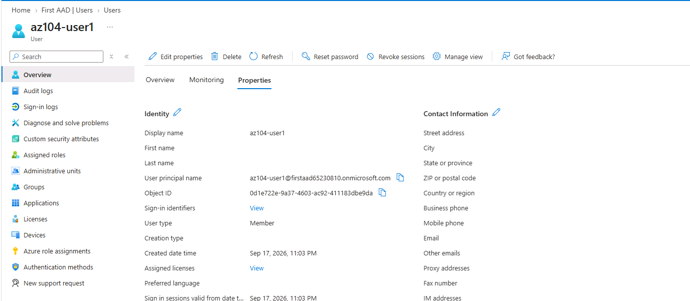
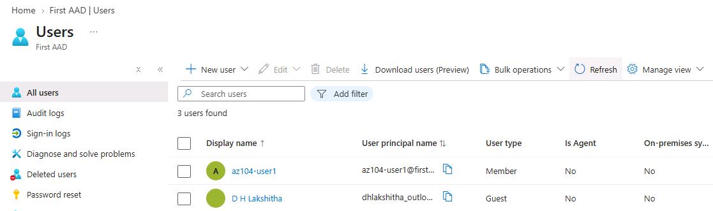
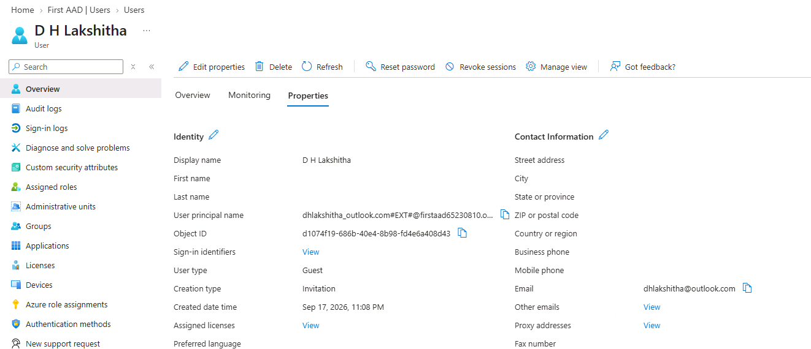
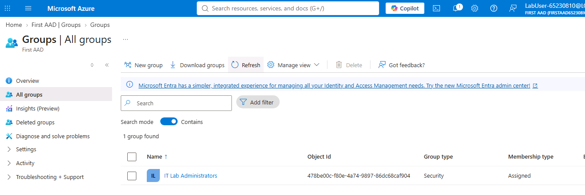
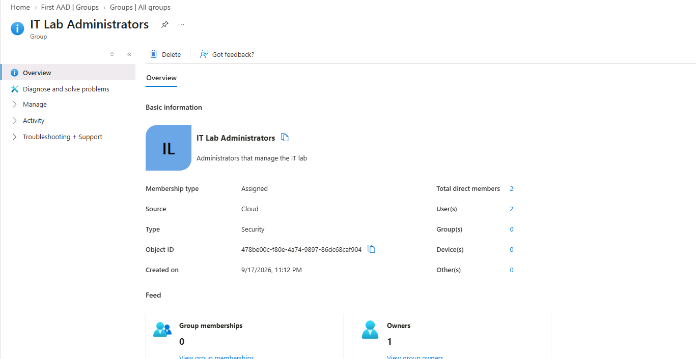
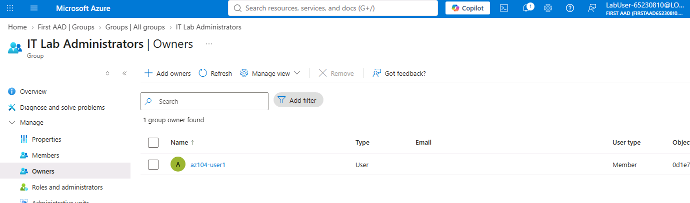
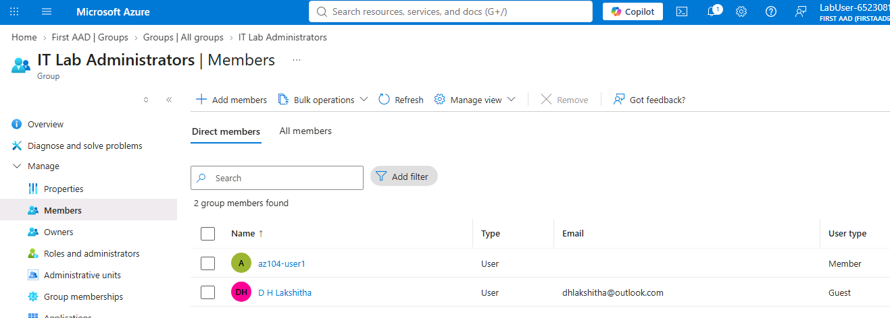

# AZ-104 Lab 01 — Manage Microsoft Entra ID Identities


## 📋 Overview

This repository documents my hands-on implementation of **Lab 01 — Manage Microsoft Entra ID Identities** as part of my preparation for the **Microsoft Azure Administrator (AZ-104)** certification.

The lab was completed using the **Microsoft Official Curriculum (MOC) lab environment**.

The primary focus of this lab was understanding and practicing identity management with **Microsoft Entra ID**, including tenant management, user provisioning, guest user invitations, Security groups, group ownership, and group membership.

---

## 🎯 Objectives

The main objectives of this lab were to:

* Create and manage a Microsoft Entra ID tenant
* Explore Microsoft Entra ID through the Azure Portal
* Create an internal user account
* Configure user identity properties
* Invite an external user as a guest
* Create a Security group
* Assign a group owner
* Add users to a group
* Understand assigned group membership
* Understand the concept of dynamic group membership
* Gain practical experience with cloud identity administration

---

# ☁️ Lab Environment

| Component            | Details                                       |
| -------------------- | --------------------------------------------- |
| Cloud Platform       | Microsoft Azure                               |
| Identity Service     | Microsoft Entra ID                            |
| Certification        | AZ-104 Microsoft Azure Administrator          |
| Lab                  | Lab 01 — Manage Microsoft Entra ID Identities |
| Lab Environment      | Microsoft Official Curriculum (MOC)           |
| Management Interface | Azure Portal                                  |
| Region               | East US                                       |
| Group Type           | Security                                      |
| Membership Type      | Assigned                                      |

---

# 🏢 Lab Scenario

The scenario represents an organization creating a new **pre-production lab environment** for testing applications and services.

Several engineers need to manage the environment, including virtual machines. To allow these engineers to authenticate using Microsoft Entra ID, user accounts and groups must be provisioned.

The organization also wants to reduce administrative overhead by using group membership based on user properties such as job title.

This lab therefore provides practical experience with the identity foundation required for Azure access management.

---

# 🗺️ Lab Architecture

The identity structure implemented during the lab can be represented as:

```text
                         Microsoft Azure
                               │
                               ▼
                      Microsoft Entra ID
                           Tenant
                        "First AAD"
                               │
                 ┌─────────────┴─────────────┐
                 │                           │
                 ▼                           ▼
          Internal User                Guest User
          az104-user1                 External User
                 │                           │
                 └─────────────┬─────────────┘
                               ▼
                    Security Group
                 IT Lab Administrators
                               │
                               ▼
                       Group Membership
```

---

# 🔹 Task 1 — Create and Configure a Microsoft Entra ID Tenant

## Objective

Create a Microsoft Entra ID tenant to provide a dedicated identity environment for the lab.

## Implementation

I created a new Microsoft Entra ID tenant through the Azure Portal and switched to the newly created directory.

### Configuration

| Setting             | Value              |
| ------------------- | ------------------ |
| Organization Name   | `First AAD`        |
| Initial Domain Name | `firstaad65229681` |
| Country/Region      | `United States`    |

### Steps Performed

1. Signed in to the Azure Portal.
2. Opened **Microsoft Entra ID**.
3. Navigated to **Manage tenants**.
4. Selected **Create**.
5. Selected the Workforce tenant configuration.
6. Selected **Microsoft Entra ID**.
7. Entered the required tenant information.
8. Reviewed the configuration.
9. Created the tenant.
10. Switched to the newly created tenant.

### Evidence — Microsoft Entra ID



**Figure 1:** Microsoft Entra ID overview showing the identity environment.

### Evidence — Tenant Creation



**Figure 2:** Newly created tenant visible under tenant management.

### Result

The Microsoft Entra ID tenant was successfully created and selected as the active directory for the lab.

---

# 🔹 Task 2 — Create an Internal User

## Objective

Create an internal Microsoft Entra ID user and configure the user's identity information.

User accounts are the fundamental identity objects used to represent people within the cloud directory.

## User Configuration

| Property            | Value                  |
| ------------------- | ---------------------- |
| User Principal Name | `az104-user1`          |
| Display Name        | `az104-user1`          |
| Account             | Enabled                |
| Password            | Auto-generated         |
| Job Title           | `IT Lab Administrator` |
| Department          | `IT`                   |
| Usage Location      | `United States`        |

## Steps Performed

1. Opened **Microsoft Entra ID**.
2. Navigated to **Users**.
3. Selected **New user**.
4. Selected **Create new user**.
5. Configured the user principal name and display name.
6. Enabled the account.
7. Configured an automatically generated password.
8. Added the job title.
9. Added the department.
10. Configured the usage location.
11. Reviewed the configuration.
12. Created the user.
13. Verified the user in the Users list.

### Evidence — User Account



**Figure 3:** The `az104-user1` account successfully created in Microsoft Entra ID.

### Evidence — User Properties



**Figure 4:** User properties configured for the internal identity.

### Result

The internal user account was successfully created and configured.

---

# 🔹 Task 3 — Invite an External User

## Objective

Understand how Microsoft Entra ID supports collaboration with users outside the organization.

An external user can be invited as a **guest identity**, allowing controlled collaboration without creating the user as a normal internal organizational account.

## Configuration

| Property       | Value                  |
| -------------- | ---------------------- |
| User Type      | Guest                  |
| Job Title      | `IT Lab Administrator` |
| Department     | `IT`                   |
| Usage Location | `United States`        |
| Invitation     | Sent                   |

## Steps Performed

1. Navigated to **Microsoft Entra ID → Users**.
2. Selected **New user**.
3. Selected **Invite an external user**.
4. Entered the external user's email address.
5. Enabled the invitation message.
6. Added the required welcome message.
7. Configured the guest user's properties.
8. Set the job title.
9. Set the department.
10. Configured the usage location.
11. Sent the invitation.
12. Refreshed the Users page.
13. Verified the guest identity.

### Evidence — Guest User



**Figure 5:** External user successfully represented as a guest identity.

### Evidence — Guest User Properties



**Figure 6:** Properties associated with the guest identity.

### Result

The external user was successfully invited and created as a guest account in Microsoft Entra ID.

> **Security Note:** Personal email addresses and other personally identifiable information should be removed or hidden before publishing screenshots in a public GitHub repository.

---

# 🔹 Task 4 — Create a Security Group

## Objective

Create a Security group for organizing users and simplifying future access management.

Groups allow administrators to manage collections of users rather than managing each identity individually.

## Group Configuration

| Setting         | Value                                   |
| --------------- | --------------------------------------- |
| Group Type      | `Security`                              |
| Group Name      | `IT Lab Administrators`                 |
| Description     | `Administrators that manage the IT lab` |
| Membership Type | `Assigned`                              |

## Steps Performed

1. Opened **Microsoft Entra ID**.
2. Navigated to **Groups**.
3. Selected **New group**.
4. Selected **Security** as the group type.
5. Entered the group name.
6. Added the group description.
7. Selected **Assigned** membership.
8. Configured the group owner.
9. Added the required users as members.
10. Created the group.
11. Opened the group and reviewed its configuration.

### Evidence — Security Group



**Figure 7:** Security group successfully created.

### Evidence — Group Overview



**Figure 8:** Overview of the `IT Lab Administrators` Security group.

### Result

The Security group was successfully created with assigned membership.

---

# 🔹 Task 5 — Configure Group Ownership

## Objective

Assign an owner to the Security group.

Group ownership provides administrative responsibility for managing the group.

## Steps Performed

1. Opened the `IT Lab Administrators` group.
2. Navigated to the **Owners** section.
3. Selected the required administrator account.
4. Added the account as a group owner.
5. Verified the owner assignment.

### Evidence



**Figure 9:** Group owner successfully assigned.

### Result

The administrator account was successfully assigned as an owner of the Security group.

---

# 🔹 Task 6 — Add Members to the Security Group

## Objective

Add both the internal user and the external guest user to the Security group.

## Group Membership

```text
IT Lab Administrators
│
├── az104-user1
│
└── Guest User
```

## Steps Performed

1. Opened the `IT Lab Administrators` group.
2. Navigated to **Members**.
3. Selected **Add members**.
4. Selected `az104-user1`.
5. Selected the invited guest user.
6. Added both users to the group.
7. Verified the membership list.

### Evidence



**Figure 10:** Internal and external users successfully added to the Security group.

### Result

Both required identities were successfully added to the Security group.

---

# 🧠 Key Concepts

## 1. Microsoft Entra ID

**Microsoft Entra ID** is Microsoft's cloud-based identity and access management service.

It provides identity-related capabilities for users, groups, applications, devices, and access control across Microsoft cloud services.

---

## 2. Microsoft Entra ID Tenant

A tenant represents a dedicated instance of Microsoft Entra ID.

A simplified structure is:

```text
Microsoft Entra ID Tenant
│
├── Users
├── Groups
├── Applications
├── Devices
└── Identity Configuration
```

The tenant provides the identity boundary in which these objects are managed.

---

## 3. Internal Users

Internal users represent identities that belong to the organization.

Their directory properties can contain information such as:

* Display name
* Department
* Job title
* Usage location
* Account status

These properties can also be used for management and automation scenarios.

---

## 4. Guest Users

Guest users represent external identities that have been invited to collaborate with the organization.

A simplified process is:

```text
External User
      │
      ▼
Invitation
      │
      ▼
Microsoft Entra ID
      │
      ▼
Guest Identity
```

Guest identities can then be managed and assigned appropriate access.

---

# 👥 Security Groups

Security groups allow administrators to organize users or devices into logical collections.

Without groups, access management could become difficult:

```text
User A → Access
User B → Access
User C → Access
User D → Access
```

With groups:

```text
             Security Group
                   │
        ┌──────────┼──────────┐
        ▼          ▼          ▼
      User A     User B     User C
```

This makes group-based access management more scalable.

---

# 🔄 Assigned vs Dynamic Membership

## Assigned Membership

The group created in this lab uses **Assigned** membership.

Members are manually added or removed by an administrator.

```text
Administrator
      │
      ▼
Add / Remove Member
      │
      ▼
Security Group
```

This provides direct administrative control over membership.

## Dynamic Membership

Dynamic groups can automatically determine membership using user or device properties.

For example:

```text
User Property
      │
      ▼
Job Title = IT Lab Administrator
      │
      ▼
Membership Rule
      │
      ▼
IT Administrators Group
```

This can reduce manual administration when managing large numbers of identities.

> Dynamic group membership requires the appropriate Microsoft Entra licensing.

---

# 🔐 Identity Management Model

The lab demonstrates the basic relationship between identities and groups:

```text
                         Microsoft Entra ID
                                │
              ┌─────────────────┴─────────────────┐
              │                                   │
              ▼                                   ▼
        Internal User                        Guest User
              │                                   │
              └─────────────────┬─────────────────┘
                                ▼
                         Security Group
                                │
                                ▼
                         Group Membership
                                │
                                ▼
                         Access Management
```

This model provides a foundation for more advanced Azure administration concepts such as:

* Azure RBAC
* Administrative roles
* Conditional Access
* Identity governance
* Privileged access
* Resource access management

---

# 💡 What I Learned

## Tenant Management

I learned how a Microsoft Entra ID tenant provides a dedicated identity environment and how administrators can manage and switch between directories.

## User Provisioning

I gained hands-on experience creating a Microsoft Entra ID user and configuring identity-related properties such as department, job title, and usage location.

## Guest Identity Management

I learned how external users can be invited to an organization's Microsoft Entra ID environment as guest identities.

## Group-Based Administration

I learned how Security groups can be used to organize identities and provide a foundation for group-based access management.

## Group Ownership

I learned how group owners can be assigned to provide administrative responsibility for a group.

## Assigned Membership

I gained practical experience manually adding users to a Security group using assigned membership.

## Dynamic Group Concept

I learned how user properties such as job title can potentially be used to automatically manage group membership through dynamic membership rules.

---

# 🛠️ Skills Demonstrated

### Microsoft Azure

* Azure Portal
* Microsoft Entra ID
* Tenant management
* Cloud identity administration

### Identity & Access Management

* User provisioning
* User property management
* Guest user management
* Security group management
* Group ownership
* Group membership
* Assigned membership
* Dynamic membership concepts

### Cloud Administration

* Azure Portal navigation
* Directory management
* Identity configuration
* Basic access management
* Cloud administration fundamentals

---

# 🧪 Hands-On Validation

| Validation                        | Result |
| --------------------------------- | -----: |
| Microsoft Entra ID tenant created |      ✅ |
| Tenant successfully selected      |      ✅ |
| Internal user created             |      ✅ |
| User properties configured        |      ✅ |
| External user invited             |      ✅ |
| Guest identity created            |      ✅ |
| Security group created            |      ✅ |
| Group owner assigned              |      ✅ |
| Internal user added to group      |      ✅ |
| Guest user added to group         |      ✅ |
| Group membership verified         |      ✅ |

---

# 📊 Lab Summary

| Area                   | Hands-On Activity                               |
| ---------------------- | ----------------------------------------------- |
| Tenant                 | Created and managed a Microsoft Entra ID tenant |
| Identity               | Created an internal user                        |
| User Management        | Configured user properties                      |
| External Collaboration | Invited an external guest user                  |
| Groups                 | Created a Security group                        |
| Ownership              | Assigned a group owner                          |
| Membership             | Added internal and guest users                  |
| Identity Concepts      | Studied assigned and dynamic membership         |

---

# 🔗 AZ-104 Skills Connection

This lab provides a foundation for several Azure Administrator skills that are used throughout the AZ-104 curriculum.

```text
Microsoft Entra ID
       │
       ├── Users
       ├── Groups
       └── Identity Management
               │
               ▼
          Access Control
               │
               ▼
          Azure RBAC
               │
               ▼
       Azure Resource Management
```

The identity concepts practiced in this lab are relevant to later administration tasks involving Azure resources, permissions, governance, and access control.

---

# 📸 Evidence

All screenshots captured during the lab are stored in the [`screenshots`](./screenshots/) directory.

| Screenshot                      | Evidence                       |
| ------------------------------- | ------------------------------ |
| `01-entra-id-overview.png`      | Microsoft Entra ID environment |
| `02-tenant-created.png`         | Created tenant                 |
| `03-user-created.png`           | Internal user creation         |
| `04-user-properties.png`        | User configuration             |
| `05-guest-user.png`             | Guest user                     |
| `06-guest-user-properties.png`  | Guest properties               |
| `07-security-group-created.png` | Security group creation        |
| `08-group-overview.png`         | Group configuration            |
| `09-group-members.png`          | Group membership               |
| `10-group-owners.png`           | Group ownership                |

---

# 📚 References

* Microsoft Learn — Microsoft Entra ID
* Microsoft Learn — Create users and groups in Microsoft Entra ID
* Microsoft Learn — Understand Microsoft Entra ID
* Microsoft Learn — Microsoft Entra self-service password reset
* Microsoft Official Curriculum — AZ-104 Microsoft Azure Administrator

---

# 🔐 Security Notice

This repository documents my personal hands-on learning activities using the Microsoft Official Curriculum lab environment.

The repository should **never contain sensitive authentication information**.

The following information must not be committed:

* Passwords
* Temporary Access Passes (TAP)
* MFA codes
* API keys
* Client secrets
* Access tokens
* Private keys
* Personal authentication information

Screenshots should also be reviewed before publishing to ensure that sensitive or personally identifiable information is not exposed.

---

# ✅ Lab Status

**Completed — AZ-104 Lab 01: Manage Microsoft Entra ID Identities**

This lab provided practical experience with Microsoft Entra ID tenant management, user provisioning, guest identities, Security groups, group ownership, and group membership.

It established the identity-management foundation required for further Azure administration and access-control labs.
