# AZ-104 Lab 02a — Manage Subscriptions and RBAC


## 📌 Overview

This lab focuses on **Azure Management Groups and Role-Based Access Control (RBAC)**.

The objective is to understand how Azure subscriptions can be organized using management groups and how permissions can be controlled through Azure RBAC. The lab also demonstrates the difference between using built-in roles and creating a custom RBAC role based on the principle of least privilege.

The hands-on implementation includes:

* Creating an Azure Management Group
* Reviewing built-in Azure RBAC roles
* Assigning the **Virtual Machine Contributor** role
* Creating a custom RBAC role
* Excluding unnecessary permissions from a custom role
* Reviewing role definitions through JSON
* Monitoring role assignments through the Azure Activity Log

---

## 🎯 Objectives

By completing this lab, I practiced the following Azure administration skills:

* Implement Azure Management Groups
* Understand Azure RBAC role definitions
* Review built-in Azure roles
* Assign RBAC roles at the management group scope
* Assign roles to groups rather than individual users
* Create custom RBAC roles
* Apply the principle of least privilege
* Use `Actions` and `NotActions` in custom roles
* Define `AssignableScopes`
* Monitor role assignment activities using the Activity Log

---

## 🧪 Lab Environment

| Component         | Configuration                       |
| ----------------- | ----------------------------------- |
| Cloud Platform    | Microsoft Azure                     |
| Identity Platform | Microsoft Entra ID                  |
| Management        | Azure Management Groups             |
| Authorization     | Azure RBAC                          |
| Scope             | Management Group                    |
| Built-in Role     | Virtual Machine Contributor         |
| Custom Role       | Custom Support Request              |
| Monitoring        | Azure Activity Log                  |
| Region            | East US                             |
| Lab Environment   | Microsoft Official Curriculum (MOC) |
| Duration          | Approximately 20 minutes            |

---

# 🏢 Lab Scenario

The organization wants to simplify Azure subscription management and provide Help Desk users with controlled permissions across multiple subscriptions.

The required access model is:

```text
Microsoft Entra ID
       │
       ▼
Root Management Group
       │
       ▼
AZ-104 Management Group
       │
       ├── Subscription 1
       │
       ├── Subscription 2
       │
       └── Subscription 3
```

The Help Desk team requires permissions to:

* Manage virtual machines
* Create and manage support requests

However, they should **not** receive unnecessary permissions such as registering Azure resource providers.

This scenario demonstrates how Azure RBAC can be used to implement controlled access while following the **principle of least privilege**.

---

# 🏗️ Architecture

The lab implements the following authorization structure:

```text
                    Microsoft Entra ID
                           │
                           ▼
                Root Management Group
                           │
                           ▼
              ┌─────────────────────────┐
              │   AZ-104 Management     │
              │        Group            │
              └────────────┬────────────┘
                           │
             ┌─────────────┴─────────────┐
             ▼                           ▼
       Azure Subscriptions          RBAC Assignments
                                         │
                          ┌──────────────┴──────────────┐
                          ▼                             ▼
                 Virtual Machine              Custom Support
                   Contributor                    Request Role
```

---

# 🔹 Task 1 — Implement Management Groups

## Objective

Create a management group to logically organize Azure subscriptions and provide a common scope for RBAC assignments.

Management Groups provide a hierarchy above subscriptions. RBAC assignments and Azure Policy configurations applied at a management group scope can be inherited by child subscriptions.

---

## Step 1 — Open Microsoft Entra ID

1. Sign in to the Azure Portal.
2. Search for **Microsoft Entra ID**.
3. Open **Properties** from the Manage section.
4. Review the **Access management for Azure resources** setting.

This setting provides information about managing access to Azure subscriptions and management groups within the tenant.

---

## Step 2 — Open Management Groups

1. Search for **Management groups** in the Azure Portal.
2. Open the Management Groups service.
3. Select **+ Create**.

---

## Step 3 — Create the Management Group

The management group was created using the lab-provided configuration.

| Setting             | Value               |
| ------------------- | ------------------- |
| Management Group ID | `az104-mg165344278` |
| Display Name        | `az104-mg165344278` |

> **Note:** Management Group IDs must be unique within the directory. If the MOC environment provides a different ID, use the ID assigned to your lab environment.

### Evidence

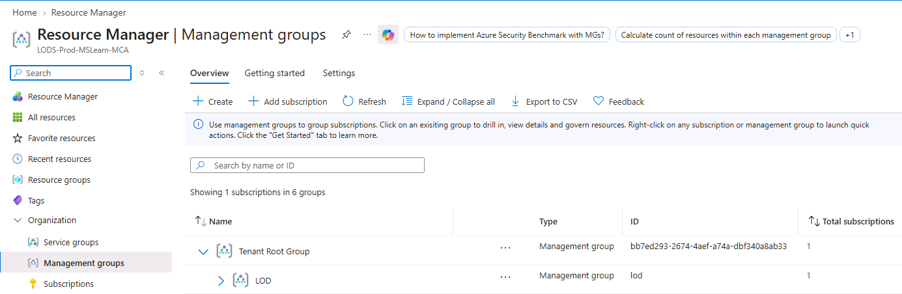

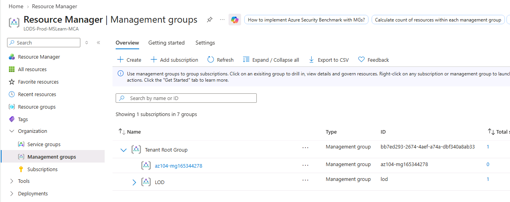

---

## Step 4 — Verify the Management Group

After creation, the management group was refreshed and verified in the Management Groups hierarchy.

The Azure hierarchy includes a built-in root management group above the management groups and subscriptions.

### Evidence

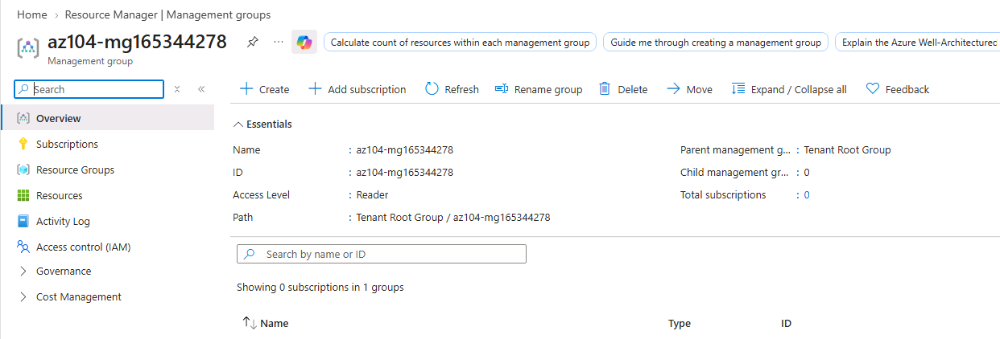

---

# 🔹 Task 2 — Review and Assign a Built-in Azure Role

## Objective

Review Azure built-in RBAC roles and assign the **Virtual Machine Contributor** role to the `IT Helpdesk` group.

The Virtual Machine Contributor role provides permissions for managing virtual machines without providing full access to the operating system or related networking and storage resources.

---

## Step 1 — Open Access Control (IAM)

1. Open the created management group.
2. Select **Access control (IAM)**.
3. Open the **Roles** tab.
4. Review the available built-in roles.

Common Azure built-in roles include:

* Owner
* Contributor
* Reader
* Virtual Machine Contributor
* Support Request Contributor

### Evidence

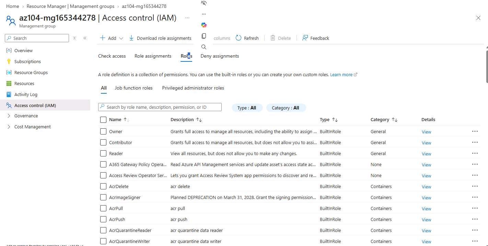

---

## Step 2 — Review Virtual Machine Contributor

The **Virtual Machine Contributor** role was reviewed to understand its permissions and scope.

This role is designed for users who need to manage virtual machines without having unrestricted permissions across the entire Azure environment.

### Evidence

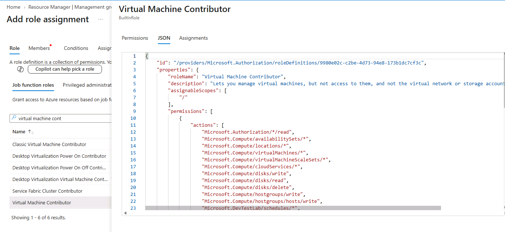

---

## Step 3 — Add Role Assignment

1. Select **+ Add**.
2. Select **Add role assignment**.
3. Search for:

```text
Virtual Machine Contributor
```

4. Select the role.
5. Continue to the **Members** tab.

---

## Step 4 — Select the IT Helpdesk Group

The `IT Helpdesk` group was selected as the role member.

```text
Role:
Virtual Machine Contributor

Member:
IT Helpdesk

Scope:
Management Group
```

### Evidence

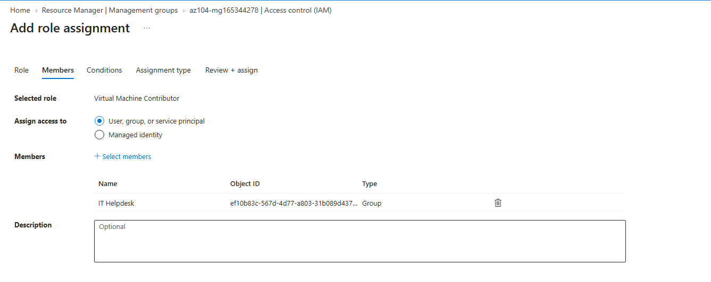

---

## Step 5 — Complete the Assignment

The assignment was reviewed and submitted.

The completed role assignment was then verified under:

**Access control (IAM) → Role assignments**

### Evidence

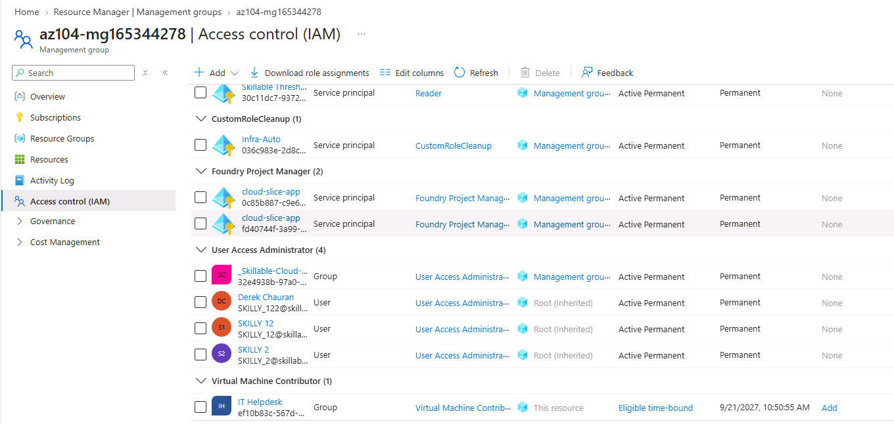

---

## 🔐 RBAC Best Practice

A key Azure RBAC best practice demonstrated in this task is:

> Assign roles to groups rather than directly to individual users whenever possible.

This simplifies access management because users can be added or removed from the group without changing individual role assignments.

---

# 🔹 Task 3 — Create a Custom RBAC Role

## Objective

Create a custom RBAC role based on the existing **Support Request Contributor** role and remove an unnecessary permission.

This demonstrates the principle of **least privilege**.

Instead of giving the Help Desk more permissions than required, the custom role removes the ability to register an Azure resource provider.

---

# Step 1 — Create Custom Role

From:

**Management Group → Access control (IAM)**

1. Select **+ Add**.
2. Select **Add custom role**.
3. Configure the Basics section.

| Setting              | Value                                             |
| -------------------- | ------------------------------------------------- |
| Custom Role Name     | `Custom Support Request65344278`                  |
| Description          | `A custom contributor role for support requests.` |
| Baseline Permissions | Clone a role                                      |
| Role to Clone        | Support Request Contributor                       |

### Evidence

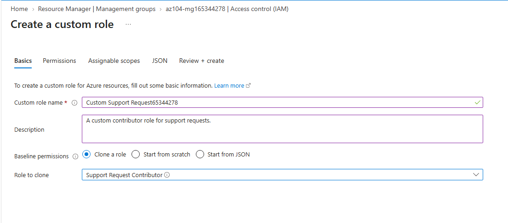

---

# Step 2 — Configure Permissions

On the **Permissions** tab:

1. Select **+ Exclude permissions**.
2. Search for:

```text
.Support
```

3. Select:

```text
Microsoft.Support
```

4. Locate:

```text
Other: Registers Support Resource Provider
```

5. Add this permission to the excluded permissions.

This causes the permission to be represented as a `NotAction` in the custom role definition.

### Evidence

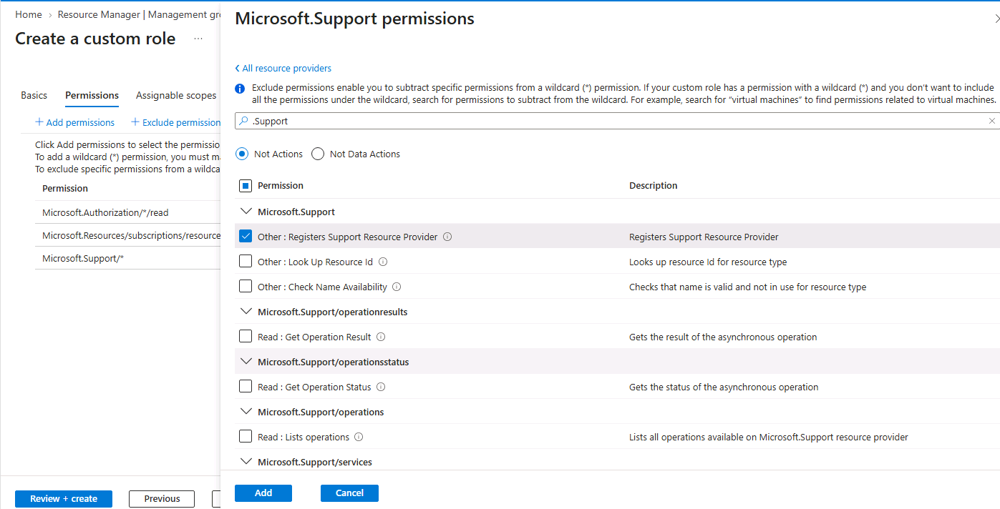

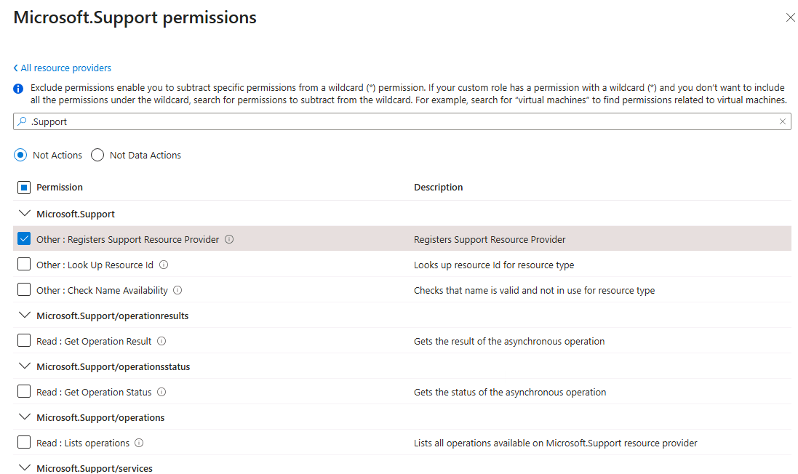

---

# 🔐 Why Exclude This Permission?

The Help Desk requires support-related capabilities, but it does not need permission to register the Microsoft Support resource provider.

Removing this permission reduces unnecessary access.

This is an example of implementing:

```text
Least Privilege
      ↓
Only required permissions
      ↓
Reduced administrative exposure
```

---

# Step 3 — Configure Assignable Scope

On the **Assignable Scopes** tab, the created management group was selected as the scope where the custom role can be assigned.

### Evidence

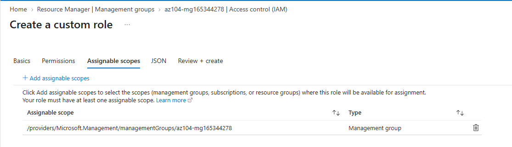

---

# Step 4 — Review Custom Role JSON

Before creating the role, the JSON definition was reviewed.

Important elements include:

```json
{
    "Actions": [],
    "NotActions": [],
    "AssignableScopes": []
}
```

The exact generated JSON depends on the role configuration in the Azure environment.

The important elements reviewed were:

* `Actions`
* `NotActions`
* `AssignableScopes`

### Evidence

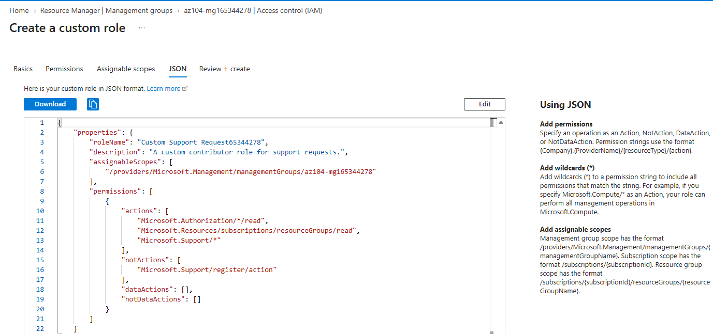

---

# Step 5 — Create the Custom Role

After reviewing the configuration:

1. Select **Review + Create**.
2. Validate the configuration.
3. Select **Create**.

The custom RBAC role was successfully created.

### Evidence

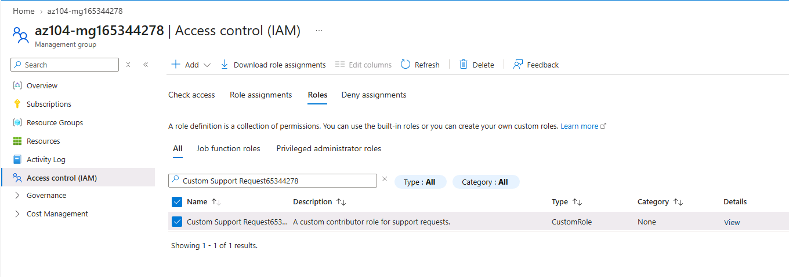

---

# 🔹 Task 4 — Monitor Role Assignments with Activity Log

## Objective

Use the Azure Activity Log to monitor administrative operations related to role assignments.

The Activity Log provides visibility into activities occurring at the Azure resource or management scope.

---

## Step 1 — Open Activity Log

1. Navigate to the created management group.
2. Open **Activity log**.
3. Review recent activities.
4. Filter the activities to identify role assignment operations.

---

## Step 2 — Review Role Assignment Activity

The Activity Log was used to identify changes related to RBAC role assignments.

This provides an audit trail that can help administrators understand:

* Who performed an operation
* What operation was performed
* When the operation occurred
* Which resource or scope was affected
* Whether administrative changes occurred

### Evidence

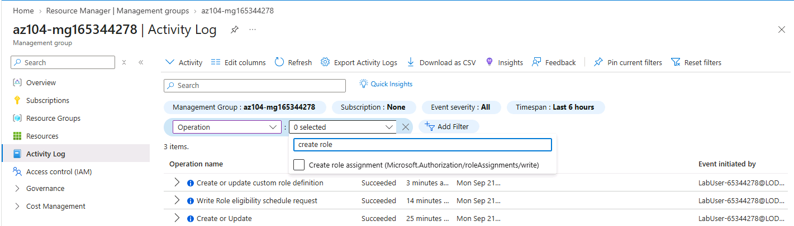

---

# 🧠 Key Concepts

## 1. Azure Management Groups

Management Groups provide a hierarchy above Azure subscriptions.

They can be used to organize subscriptions based on:

* Department
* Business unit
* Environment
* Geography
* Organizational structure

Example:

```text
Root Management Group
        │
        ├── Production
        │      ├── Subscription A
        │      └── Subscription B
        │
        └── Non-Production
               ├── Subscription C
               └── Subscription D
```

---

## 2. Azure RBAC

Azure Role-Based Access Control controls who can perform which actions on Azure resources.

The basic RBAC model is:

```text
Security Principal
        +
      Role
        +
      Scope
        =
     Access
```

For this lab:

```text
IT Helpdesk
     +
Virtual Machine Contributor
     +
Management Group
     =
Controlled VM Management Access
```

---

## 3. Scope

Azure RBAC can be assigned at different scopes.

```text
Management Group
       ↓
Subscription
       ↓
Resource Group
       ↓
Resource
```

An assignment at a higher scope can be inherited by lower scopes.

---

## 4. Built-in Roles

Azure provides many predefined roles.

Examples include:

| Role                        | General Purpose                               |
| --------------------------- | --------------------------------------------- |
| Owner                       | Full management including access management   |
| Contributor                 | Manage resources but cannot assign RBAC roles |
| Reader                      | View resources                                |
| Virtual Machine Contributor | Manage virtual machines                       |
| Support Request Contributor | Manage support requests                       |

The exact permissions should always be reviewed before assigning a role.

---

# 🛡️ Principle of Least Privilege

The custom role portion of this lab demonstrates the **principle of least privilege**.

The objective is to provide users with only the permissions required for their responsibilities.

```text
Required Permission
       ↓
Grant Access
       ↓
Identify Unnecessary Permission
       ↓
Exclude Permission
       ↓
Custom Least-Privilege Role
```

In this lab, the ability to register the Microsoft Support resource provider was excluded from the custom role.

---

# 🔧 Actions vs NotActions

Azure custom RBAC roles can use:

### Actions

Define the operations that a role can perform.

```text
Actions
  ↓
Allowed operations
```

### NotActions

Define operations that should be excluded from the permissions granted by the role.

```text
NotActions
  ↓
Excluded operations
```

For this lab, the support resource provider registration operation was excluded through `NotActions`.

---

# 📋 Role Definition Components

A custom Azure RBAC role contains important properties such as:

| Property           | Purpose                               |
| ------------------ | ------------------------------------- |
| `Name`             | Name of the role                      |
| `Description`      | Purpose of the role                   |
| `Actions`          | Allowed management operations         |
| `NotActions`       | Excluded management operations        |
| `DataActions`      | Data-plane permissions                |
| `NotDataActions`   | Excluded data-plane permissions       |
| `AssignableScopes` | Scopes where the role can be assigned |

---

# 📊 Built-in vs Custom RBAC Roles

| Feature                                           | Built-in Role                    | Custom Role            |
| ------------------------------------------------- | -------------------------------- | ---------------------- |
| Predefined by Azure                               | Yes                              | No                     |
| Ready to use                                      | Yes                              | Requires configuration |
| Permission customization                          | Limited to predefined definition | High                   |
| Least-privilege customization                     | Depends on role                  | More granular          |
| JSON definition                                   | Azure-defined                    | Organization-defined   |
| Suitable for standard access                      | Yes                              | Yes                    |
| Suitable for specific organizational requirements | Sometimes                        | Yes                    |

---

# 📝 What I Learned

Through this lab, I gained hands-on experience with Azure subscription governance and authorization.

### Key learning points

* Learned how Azure Management Groups organize subscriptions.
* Understood the hierarchical relationship between management groups and subscriptions.
* Learned how RBAC assignments can be inherited through Azure scopes.
* Practiced reviewing built-in Azure role definitions.
* Assigned the Virtual Machine Contributor role to a group.
* Understood why group-based RBAC assignments are preferred over individual assignments.
* Created a custom RBAC role by cloning an existing role.
* Learned how to remove unnecessary permissions using `NotActions`.
* Understood how `AssignableScopes` controls where a custom role can be assigned.
* Reviewed the JSON structure of an Azure custom role.
* Used the Activity Log to monitor role assignment activities.
* Applied the principle of least privilege to Azure access management.

---

# 💼 Skills Demonstrated

### Azure Administration

* Azure Management Groups
* Azure Subscription Governance
* Azure RBAC
* Azure IAM
* Azure Activity Log

### Identity & Access Management

* Group-based access control
* Role assignments
* Role scopes
* Built-in roles
* Custom roles
* Least privilege

### Governance

* Management hierarchy
* Subscription organization
* Permission control
* Administrative auditing
* RBAC monitoring

---

# ✅ Hands-On Validation

The following activities were completed successfully:

| Validation                                        | Status      |
| ------------------------------------------------- | ----------- |
| Management Group created                          | ✅ Completed |
| Management Group verified                         | ✅ Completed |
| Built-in roles reviewed                           | ✅ Completed |
| Virtual Machine Contributor reviewed              | ✅ Completed |
| IT Helpdesk group assigned role                   | ✅ Completed |
| Role assignment verified                          | ✅ Completed |
| Custom RBAC role created                          | ✅ Completed |
| Support provider registration permission excluded | ✅ Completed |
| Assignable scope configured                       | ✅ Completed |
| Custom role JSON reviewed                         | ✅ Completed |
| Custom role created                               | ✅ Completed |
| Activity Log reviewed                             | ✅ Completed |

---

# 📸 Evidence

| #  | Evidence                  | Screenshot                               |
| -- | ------------------------- | ---------------------------------------- |
| 01 | Management Groups         | `01-management-groups-overview.png`      |
| 02 | Management Group Created  | `02-management-group-created.png`        |
| 03 | Management Group Overview | `03-management-group-overview.png`       |
| 04 | RBAC Roles                | `04-rbac-roles.png`                      |
| 05 | VM Contributor Role       | `05-vm-contributor-role.png`             |
| 06 | Role Assignment Members   | `06-role-assignment-members.png`         |
| 07 | VM Contributor Assignment | `07-vm-contributor-assignment.png`       |
| 08 | Custom Role Basics        | `08-custom-role-basics.png`              |
| 09 | Custom Role Permissions   | `09-custom-role-permissions.png`         |
| 10 | Excluded Permission       | `10-custom-role-excluded-permission.png` |
| 11 | Assignable Scope          | `11-custom-role-assignable-scope.png`    |
| 12 | Custom Role JSON          | `12-custom-role-json.png`                |
| 13 | Custom Role Created       | `13-custom-role-created.png`             |
| 14 | Activity Log              | `14-activity-log-role-assignment.png`    |

---

# 🔗 AZ-104 Skills Connection

This lab directly supports the Azure Administrator skill area of **Manage Azure governance and identities**.

The practical skills demonstrated here are relevant to real-world Azure administration tasks such as:

```text
Azure Tenant
     ↓
Management Groups
     ↓
Subscriptions
     ↓
Resource Groups
     ↓
Resources
     ↓
RBAC
     ↓
Least Privilege
     ↓
Monitoring / Auditing
```

Understanding this hierarchy is important when managing Azure environments at organizational scale.

---

# 🧹 Cleanup

If this lab is performed in a personal Azure subscription rather than an MOC-provided environment, unnecessary resources should be removed after completing the exercise.

The management group can be deleted from the Azure Portal after removing applicable child resources/subscriptions as required.

Azure CLI can also be used for management group deletion:

```bash
az account management-group delete --name <management-group-name>
```

> **Note:** Follow the cleanup requirements of the MOC environment before deleting anything. Do not remove shared resources that are required by other labs.

---

# 🔐 Security Notice

This repository is intended to demonstrate Azure hands-on skills.

The following information must **never** be committed to GitHub:

* Passwords
* Temporary Access Passes
* MFA codes
* Access tokens
* API keys
* Client secrets
* Private keys
* Personal authentication information
* Sensitive tenant information

Before publishing screenshots, review them and crop or blur sensitive information.

---

# 📚 References

* Microsoft Azure Portal
* Microsoft Entra ID
* Azure Management Groups
* Azure Role-Based Access Control (RBAC)
* Azure Activity Log
* Microsoft Learn — Azure RBAC training

---

# 🏁 Lab Summary

This lab provided practical experience with **Azure Management Groups and Role-Based Access Control**.

The hands-on implementation demonstrated how to organize subscriptions, assign built-in roles, create customized permissions, apply least-privilege access, and monitor authorization-related activities.

The main workflow practiced was:

```text
Management Group
       ↓
Review RBAC Roles
       ↓
Assign Built-in Role
       ↓
Create Custom Role
       ↓
Remove Unnecessary Permission
       ↓
Define Assignable Scope
       ↓
Review JSON
       ↓
Monitor Activity Log
```

This lab strengthened my understanding of Azure governance, identity, access management, and subscription-level administration.

---

## 📌 Lab Status

**Completed ✅**

**Lab:** AZ-104 Lab 02a — Manage Subscriptions and RBAC

**Focus:** Management Groups, Azure RBAC, Custom Roles, Least Privilege, Activity Log

**Platform:** Microsoft Azure

**Environment:** Microsoft Official Curriculum (MOC) Lab Environment
