# AZ-104 Lab 02b — Manage Governance via Azure Policy


## 📌 Overview

This lab focuses on **Azure Governance using Azure Policy, resource tagging, policy remediation, and resource locks**.

The purpose of this hands-on lab is to understand how organizations can establish governance standards across Azure resources and enforce those standards through Azure Policy.

The lab demonstrates how to:

* Apply metadata to Azure resources using tags
* Enforce required tags using Azure Policy
* Prevent non-compliant resource deployments
* Use Azure Policy to automatically inherit tags
* Remediate resources using a policy remediation task
* Protect Azure resources using resource locks
* Prevent accidental deletion of protected resources

---

## 🎯 Objectives

By completing this lab, I practiced the following Azure governance capabilities:

* Create and configure an Azure Resource Group
* Apply resource tags
* Review built-in Azure Policy definitions
* Assign an Azure Policy to a resource group
* Configure policy parameters
* Enforce governance requirements
* Validate policy enforcement
* Create a Modify-based policy assignment
* Configure policy remediation
* Automatically inherit tags from a resource group
* Configure a resource lock
* Test protection against resource group deletion

---

# 🧪 Lab Environment

| Component           | Configuration                       |
| ------------------- | ----------------------------------- |
| Cloud Platform      | Microsoft Azure                     |
| Identity Platform   | Microsoft Entra ID                  |
| Governance          | Azure Policy                        |
| Resource Management | Azure Resource Group                |
| Resource Group      | `az104-rg2`                         |
| Region              | East US                             |
| Tag Name            | `Cost Center`                       |
| Tag Value           | `000`                               |
| Resource Protection | Azure Resource Lock                 |
| Lock Name           | `rg-lock`                           |
| Lock Type           | Delete                              |
| Lab Environment     | Microsoft Official Curriculum (MOC) |
| Estimated Duration  | Approximately 30 minutes            |

---

# 🏢 Lab Scenario

The organization's Azure cloud footprint has grown significantly.

During an audit, it was identified that several resources did not have important ownership, project, or cost information.

To improve Azure resource governance, the organization wants to:

1. Apply resource tags containing important metadata.
2. Enforce the use of required tags for new resources.
3. Automatically apply tags to resources where appropriate.
4. Protect important resources from accidental deletion.

The lab implements these requirements using:

```text
Azure Resource Group
        │
        ├── Resource Tags
        │
        ├── Azure Policy
        │      │
        │      ├── Enforce Tag
        │      └── Inherit Tag
        │
        └── Resource Lock
               │
               └── Prevent Deletion
```

---

# 🏗️ Governance Architecture

```text
                         Azure Subscription
                                │
                                ▼
                       ┌─────────────────┐
                       │   az104-rg2     │
                       │ Resource Group  │
                       └────────┬────────┘
                                │
               ┌────────────────┼────────────────┐
               │                │                │
               ▼                ▼                ▼
          Resource Tags    Azure Policy     Resource Lock
               │                │                │
               │         ┌──────┴──────┐         │
               │         │             │         │
               │         ▼             ▼         ▼
               │      Enforce       Inherit   Delete
               │       Tags          Tags      Protection
               │
               ▼
          Cost Center
              = 000
```

---

# 🔹 Task 1 — Assign Tags via the Azure Portal

## Objective

Create an Azure Resource Group and assign a **Cost Center** tag.

Azure tags are key-value metadata that can be used to organize and identify resources.

Common organizational tagging scenarios include:

* Resource owner
* Project
* Department
* Environment
* Cost center
* Contact
* Business unit
* Lifecycle information

---

## Step 1 — Create Resource Group

From the Azure Portal:

1. Search for **Resource groups**.
2. Select **+ Create**.
3. Configure the resource group.

| Setting        | Value                   |
| -------------- | ----------------------- |
| Subscription   | Your Azure subscription |
| Resource Group | `az104-rg2`             |
| Region         | East US                 |

---

## Step 2 — Configure Resource Group Tag

Move to the **Tags** tab.

Configure:

| Tag Setting | Value         |
| ----------- | ------------- |
| Name        | `Cost Center` |
| Value       | `000`         |

Then select:

**Review + Create → Create**

### Evidence

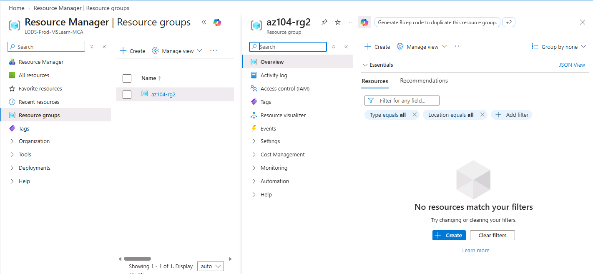

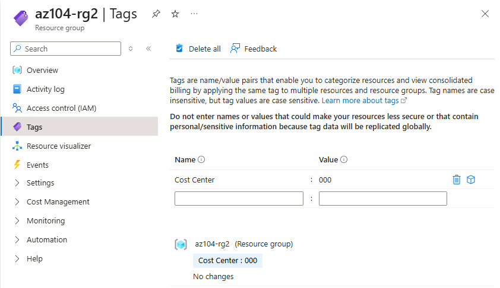

---

# 🧠 Why Tags Matter

Tags allow organizations to attach meaningful metadata to Azure resources.

For example:

```text
Cost Center = 000
Environment = Production
Owner = IT
Project = CloudMigration
Department = Finance
```

This metadata can improve:

* Resource organization
* Cost reporting
* Ownership tracking
* Resource filtering
* Governance
* Operational management

---

# 🔹 Task 2 — Enforce Tagging Using Azure Policy

## Objective

Use the built-in Azure Policy:

```text
Require a tag and its value on resources
```

The policy is assigned to the `az104-rg2` resource group and configured to require:

```text
Tag Name  : Cost Center
Tag Value : 000
```

---

# Step 1 — Open Azure Policy

1. Search for **Policy** in the Azure Portal.
2. Open **Policy**.
3. Navigate to:

```text
Authoring → Definitions
```

4. Browse the available built-in policies.
5. Search for:

```text
Require a tag and its value on resources
```

### Evidence

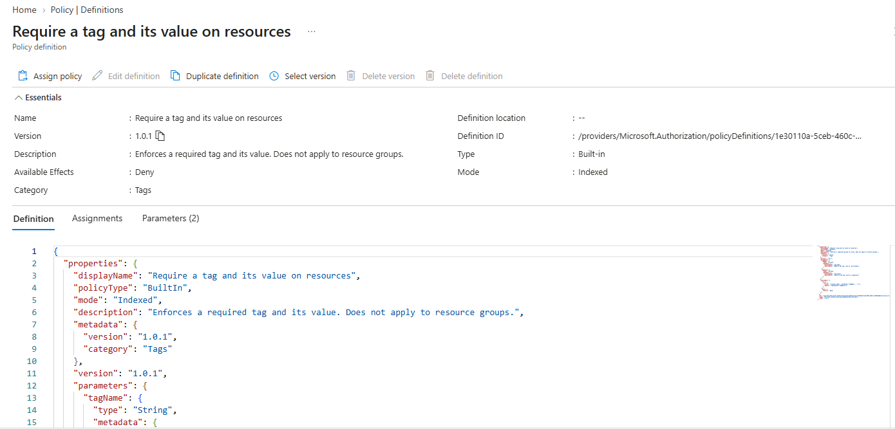

---

# Step 2 — Configure Policy Scope

Select **Assign policy**.

Configure the scope:

| Setting        | Value                   |
| -------------- | ----------------------- |
| Subscription   | Your Azure subscription |
| Resource Group | `az104-rg2`             |

Azure Policy can be assigned at different scopes, including:

```text
Management Group
       ↓
Subscription
       ↓
Resource Group
       ↓
Resource
```

For this lab, the policy is assigned at the resource group level.

### Evidence

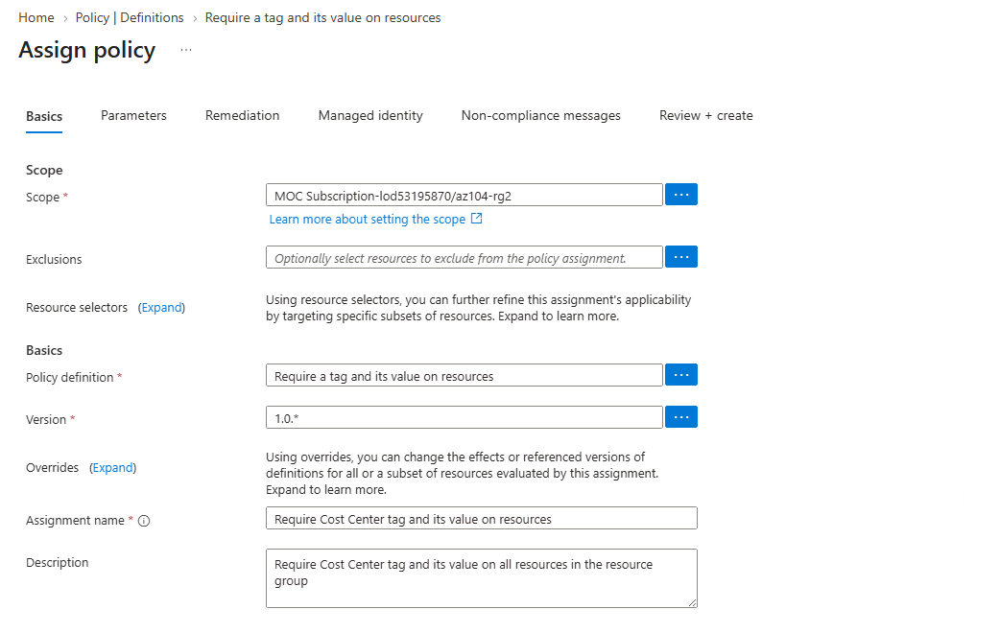

---

# Step 3 — Configure Policy Assignment

Configure the assignment:

| Setting            | Value                                                                          |
| ------------------ | ------------------------------------------------------------------------------ |
| Assignment Name    | `Require Cost Center tag and its value on resources`                           |
| Description        | `Require Cost Center tag and its value on all resources in the resource group` |
| Policy Enforcement | Enabled                                                                        |

---

# Step 4 — Configure Parameters

Set the policy parameters:

| Parameter | Value         |
| --------- | ------------- |
| Tag Name  | `Cost Center` |
| Tag Value | `000`         |

### Evidence

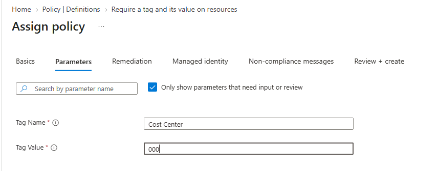

---

# Step 5 — Review and Create

Review the policy configuration.

For this assignment, the Managed Identity option is left unchecked as specified by the lab.

Select:

**Review + Create → Create**

### Evidence

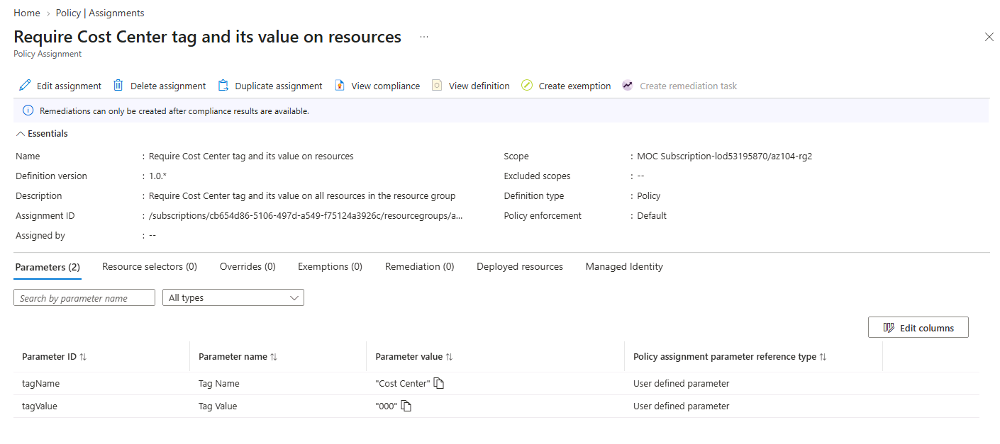

---

# 🧪 Step 6 — Test Policy Enforcement

To validate the policy:

1. Open **Storage Accounts**.
2. Select **+ Create**.
3. Use `az104-rg2` as the resource group.
4. Do not manually add the required Cost Center tag.
5. Continue through validation.
6. Attempt to create the storage account.

The policy should prevent the deployment because the required tag requirement has not been satisfied.

### Expected Result

```text
Validation failed

Resource deployment was disallowed by Azure Policy.
```

### Evidence

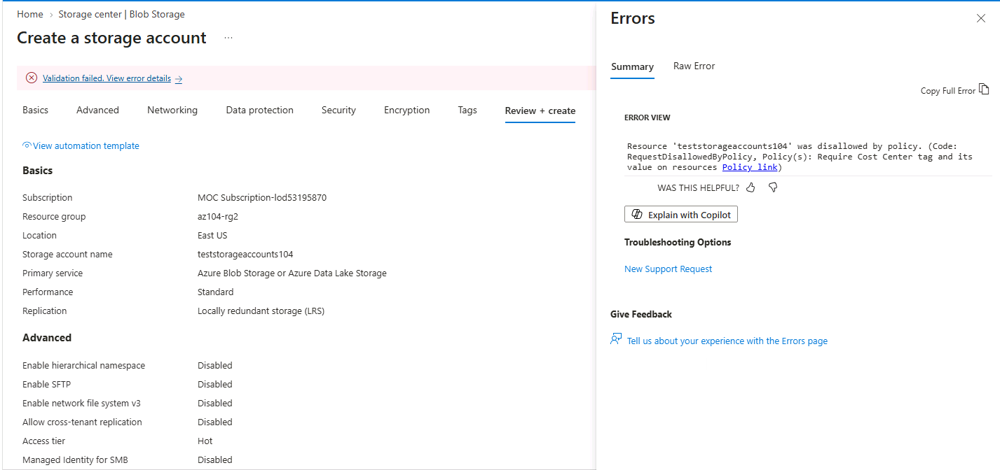

---

# 🧠 Azure Policy Enforcement

This task demonstrates how Azure Policy can enforce organizational standards.

The basic workflow is:

```text
Resource Deployment
       ↓
Azure Policy Evaluation
       ↓
Compliance Check
       ↓
 ┌─────┴─────┐
 │           │
Compliant  Non-Compliant
 │           │
Allow       Deny
```

In this scenario, a resource without the required Cost Center tag is prevented from being deployed.

---

# 🔹 Task 3 — Apply Tagging Using Azure Policy

## Objective

Use the Azure Policy definition:

```text
Inherit a tag from the resource group if missing
```

This policy allows child resources to inherit the `Cost Center` tag from the resource group.

---

# Step 1 — Review Existing Policy Assignments

Open:

```text
Policy
   → Assignments
```

Locate the existing:

```text
Require a tag and its value on resources
```

assignment.

Delete the previous assignment as required by the lab.

### Evidence

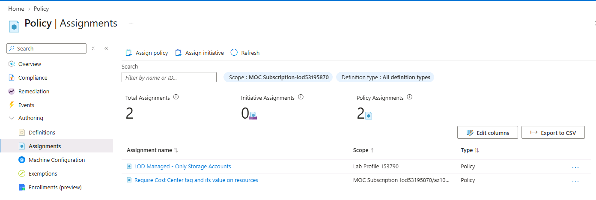

---

# Step 2 — Assign Inherit Tag Policy

Select **Assign policy**.

Configure the scope:

| Setting        | Value                   |
| -------------- | ----------------------- |
| Subscription   | Your Azure subscription |
| Resource Group | `az104-rg2`             |

For the policy definition, search for:

```text
Inherit a tag from the resource group if missing
```

### Evidence

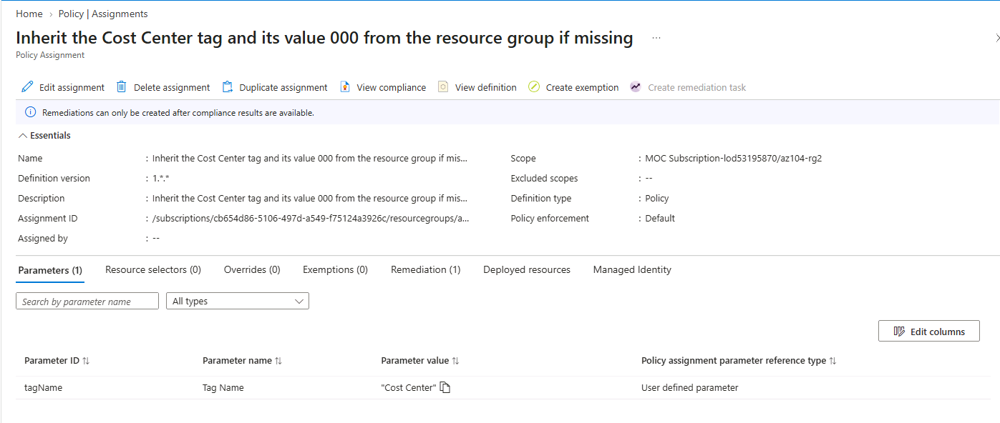

---

# Step 3 — Configure Policy Assignment

Configure:

| Setting            | Value                                                                              |
| ------------------ | ---------------------------------------------------------------------------------- |
| Assignment Name    | `Inherit the Cost Center tag and its value 000 from the resource group if missing` |
| Description        | `Inherit the Cost Center tag and its value 000 from the resource group if missing` |
| Policy Enforcement | Enabled                                                                            |

---

# Step 4 — Configure Policy Parameters

Configure:

| Parameter | Value         |
| --------- | ------------- |
| Tag Name  | `Cost Center` |

---

# Step 5 — Configure Remediation

Enable:

```text
Create a remediation task
```

The remediation configuration uses the:

```text
Inherit a tag from the resource group if missing
```

policy.

This policy uses the **Modify** effect, therefore a managed identity is required for remediation.

### Evidence

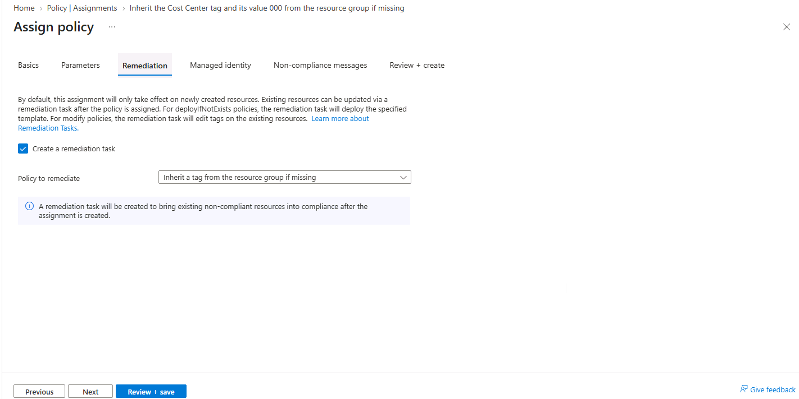

---

# Step 6 — Create Policy Assignment

Review the configuration and create the policy assignment.

### Evidence

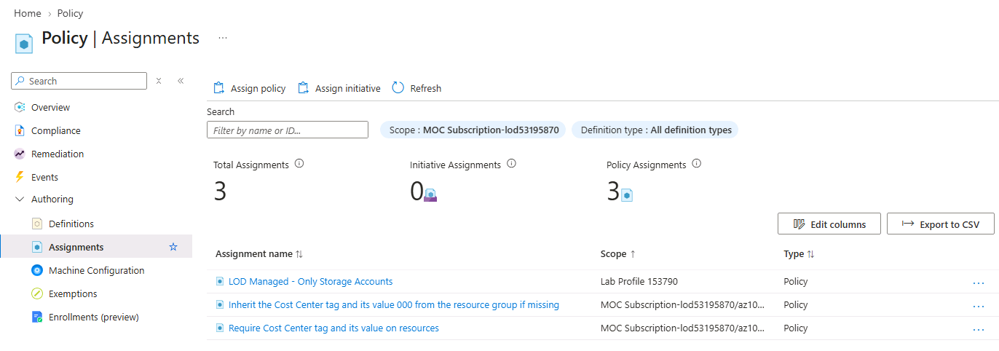

---

# 🧪 Step 7 — Test Automatic Tag Inheritance

Create another Storage Account inside:

```text
az104-rg2
```

The Storage Account should be created without manually specifying the Cost Center tag.

After deployment:

1. Open the Storage Account.
2. Navigate to **Tags**.
3. Verify that:

```text
Cost Center = 000
```

has been automatically assigned.

### Evidence

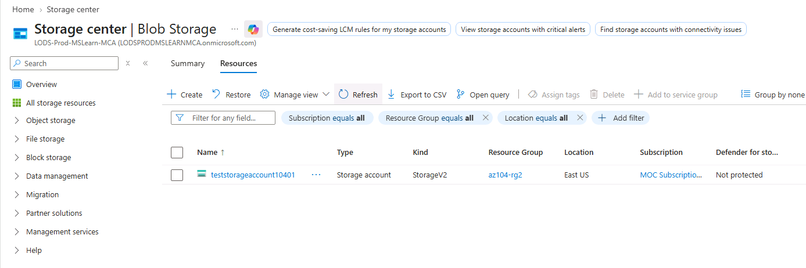

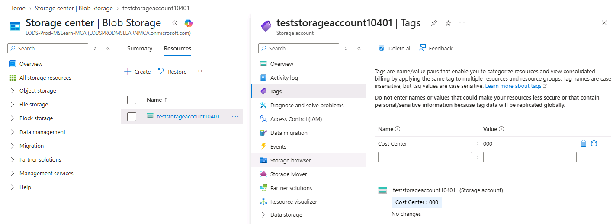

---

# 🧠 Policy Remediation

Azure Policy remediation can help bring existing non-compliant resources into compliance.

The general process is:

```text
Resource
   ↓
Policy Evaluation
   ↓
Non-Compliant
   ↓
Remediation Task
   ↓
Policy Action
   ↓
Compliant Resource
```

For this lab, the policy modifies resources so that the required Cost Center tag can be inherited from the resource group.

---

# 🔹 Task 4 — Configure and Test Resource Locks

## Objective

Configure an Azure resource lock to protect the resource group from accidental deletion.

Resource locks provide an additional protection layer even when users have sufficient permissions to perform the operation.

---

# Step 1 — Open Resource Group Locks

1. Open the `az104-rg2` resource group.
2. Navigate to:

```text
Settings → Locks
```

3. Select **Add**.

---

# Step 2 — Configure Delete Lock

Configure:

| Setting   | Value     |
| --------- | --------- |
| Lock Name | `rg-lock` |
| Lock Type | Delete    |

The Delete lock prevents deletion while allowing normal resource management operations.

### Evidence

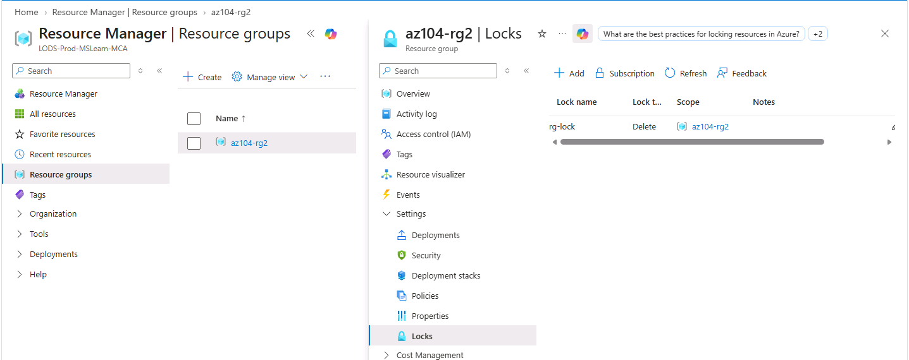

---

# Step 3 — Test Resource Group Deletion

Navigate to:

```text
Resource Group → Overview
```

Select:

**Delete resource group**

Enter:

```text
az104-rg2
```

and attempt to delete the resource group.

Because the delete lock is configured, the deletion should be denied.

### Expected Result

```text
Deletion denied
```

### Evidence

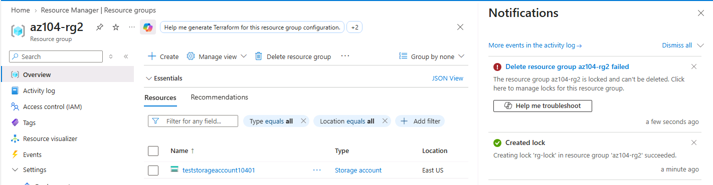

---

# 🛡️ Resource Locks

Azure provides resource locks to protect resources against accidental changes.

Common lock types include:

| Lock Type | Effect                             |
| --------- | ---------------------------------- |
| Delete    | Prevents deletion                  |
| Read-only | Prevents modification and deletion |

The lock is an additional protection mechanism and can override normal user permissions for the protected operation.

---

# 📊 Azure Policy vs RBAC vs Resource Locks

| Feature                | Azure Policy                           | Azure RBAC             | Resource Lock                   |
| ---------------------- | -------------------------------------- | ---------------------- | ------------------------------- |
| Primary Purpose        | Governance / compliance                | Access control         | Resource protection             |
| Controls permissions   | No                                     | Yes                    | No                              |
| Enforces configuration | Yes                                    | No                     | No                              |
| Prevents deletion      | Can influence deployment/configuration | Depends on permissions | Yes                             |
| Applies at hierarchy   | Yes                                    | Yes                    | Yes                             |
| Example                | Require Cost Center tag                | VM Contributor         | Delete lock                     |
| Main Focus             | What configuration is allowed          | Who can do what        | Protect from accidental changes |

---

# 🔐 Governance Model Demonstrated

This lab demonstrates multiple layers of Azure governance:

```text
                 Azure Governance
                       │
        ┌──────────────┼──────────────┐
        │              │              │
        ▼              ▼              ▼
      Tags          Azure Policy   Resource Locks
        │              │              │
        ▼              ▼              ▼
   Metadata       Compliance      Protection
        │              │              │
        └──────────────┼──────────────┘
                       ▼
              Controlled Azure
               Environment
```

---

# 🧠 Key Concepts

## 1. Azure Tags

Tags are key-value metadata associated with Azure resources.

Example:

```text
Cost Center = 000
```

Tags can help organizations identify and manage resources.

---

## 2. Azure Policy

Azure Policy establishes organizational rules for Azure resources.

A policy evaluates resource properties against defined conditions and applies an effect when the condition is evaluated.

Examples of policy effects include:

* Deny
* Audit
* Modify
* DeployIfNotExists

This lab uses:

```text
Deny
```

to prevent non-compliant resource deployment and:

```text
Modify
```

to inherit the required tag.

---

## 3. Policy Assignment

A policy definition becomes effective at a specific scope when it is assigned.

Example:

```text
Policy Definition
       +
Resource Group Scope
       +
Parameters
       ↓
Policy Assignment
```

---

## 4. Policy Remediation

A remediation task can bring existing non-compliant resources into compliance when the policy definition supports an appropriate remediation effect.

For this lab, the Modify effect is used with a managed identity.

---

## 5. Resource Locks

Resource locks protect Azure resources from accidental deletion or modification.

The lab uses:

```text
Lock Name: rg-lock
Lock Type: Delete
```

---

# 🔄 Governance Workflow

The complete workflow practiced in this lab is:

```text
Create Resource Group
        ↓
Apply Cost Center Tag
        ↓
Create Governance Policy
        ↓
Assign Policy
        ↓
Test Policy Enforcement
        ↓
Replace with Inherit Tag Policy
        ↓
Configure Remediation
        ↓
Create Resource
        ↓
Verify Automatic Tag
        ↓
Create Resource Lock
        ↓
Test Deletion Protection
```

---

# 📝 What I Learned

Through this lab, I gained practical experience with Azure governance and compliance management.

### Key learning points

* Learned how Azure tags can be used as resource metadata.
* Practiced assigning tags to an Azure Resource Group.
* Learned how Azure Policy can enforce organizational standards.
* Created and assigned a built-in Azure Policy.
* Configured policy scope at the Resource Group level.
* Configured policy parameters for required tag names and values.
* Tested a policy that prevented non-compliant resource deployment.
* Learned how the Deny policy effect can enforce governance requirements.
* Used the `Inherit a tag from the resource group if missing` policy.
* Learned how Azure Policy can automatically apply metadata to resources.
* Configured a remediation task for a Modify-based policy.
* Understood why a managed identity is required for policy remediation.
* Created an Azure Delete resource lock.
* Tested how a resource lock prevents accidental deletion.
* Understood the difference between governance, access control, and resource protection.

---

# 💼 Skills Demonstrated

### Azure Governance

* Azure Policy
* Policy Assignments
* Policy Definitions
* Policy Parameters
* Policy Enforcement
* Policy Remediation

### Resource Management

* Azure Resource Groups
* Azure Resource Tags
* Resource Metadata
* Resource Locks

### Security & Compliance

* Governance enforcement
* Compliance management
* Least-privilege governance
* Deployment control
* Resource protection

---

# ✅ Hands-On Validation

| Validation                       | Status      |
| -------------------------------- | ----------- |
| Resource Group created           | ✅ Completed |
| Cost Center tag assigned         | ✅ Completed |
| Built-in Policy reviewed         | ✅ Completed |
| Required-tag Policy assigned     | ✅ Completed |
| Policy parameters configured     | ✅ Completed |
| Policy enforcement tested        | ✅ Completed |
| Non-compliant deployment blocked | ✅ Completed |
| Inherit-tag Policy assigned      | ✅ Completed |
| Remediation configured           | ✅ Completed |
| Storage Account created          | ✅ Completed |
| Cost Center tag inherited        | ✅ Completed |
| Delete lock configured           | ✅ Completed |
| Resource Group deletion tested   | ✅ Completed |
| Resource Group deletion blocked  | ✅ Completed |

---

# 📸 Evidence

| #  | Evidence                       | Screenshot                              |
| -- | ------------------------------ | --------------------------------------- |
| 01 | Resource Group Created         | `01-resource-group-created.png`         |
| 02 | Resource Group Cost Center Tag | `02-resource-group-cost-center-tag.png` |
| 03 | Azure Policy Definition        | `03-policy-definition.png`              |
| 04 | Policy Assignment Scope        | `04-policy-assignment-scope.png`        |
| 05 | Policy Assignment Parameters   | `05-policy-assignment-parameters.png`   |
| 06 | Policy Assignment Created      | `06-policy-assignment-created.png`      |
| 07 | Policy Deployment Denied       | `07-policy-deployment-denied.png`       |
| 08 | Policy Assignments             | `08-policy-assignments.png`             |
| 09 | Inherit Tag Policy             | `09-inherit-tag-policy.png`             |
| 10 | Policy Remediation             | `10-policy-remediation.png`             |
| 11 | Inherit Tag Policy Created     | `11-inherit-tag-policy-created.png`     |
| 12 | Storage Account Created        | `12-storage-account-created.png`        |
| 13 | Inherited Cost Center Tag      | `13-inherited-cost-center-tag.png`      |
| 14 | Resource Lock Created          | `14-resource-lock-created.png`          |
| 15 | Resource Group Deletion Denied | `15-resource-group-deletion-denied.png` |

---

# 🔗 AZ-104 Skills Connection

This lab supports the Azure Administrator skill area related to **Azure governance and resource management**.

The practical governance model demonstrated is:

```text
Azure Management
       │
       ├── Tags
       │
       ├── Azure Policy
       │      ├── Enforce
       │      ├── Audit
       │      └── Remediate
       │
       └── Resource Locks
              ├── Delete Protection
              └── Modification Protection
```

These capabilities are important when managing Azure environments where organizational standards, compliance requirements, and resource protection need to be applied consistently.

---

# 🧹 Cleanup

If this lab is performed in a personal Azure subscription, remove the lab resources after completing the exercise to minimize unnecessary costs.

Before deleting the resource group, the `rg-lock` resource lock must be removed.

After removing the lock, the resource group can be deleted.

### Azure PowerShell

```powershell
Remove-AzResourceGroup -Name az104-rg2
```

### Azure CLI

```bash
az group delete --name az104-rg2
```

> **Note:** Follow the cleanup requirements of the MOC environment before removing resources. Do not delete shared resources required by other labs.

---

# 🔐 Security Notice

This repository is intended to demonstrate Azure hands-on skills.

Do not commit sensitive information to GitHub, including:

* Azure passwords
* Authentication codes
* Access tokens
* API keys
* Client secrets
* Private keys
* Personal credentials
* Sensitive tenant information

Before publishing screenshots, review each image and crop or blur sensitive information.

---

# 📚 References

* Microsoft Azure Portal
* Azure Policy
* Azure Resource Groups
* Azure Resource Tags
* Azure Resource Locks
* Microsoft Learn — Azure Policy
* Microsoft Learn — Azure Policy Initiatives

---

# 🏁 Lab Summary

This lab provided practical experience with **Azure governance using tags, Azure Policy, policy remediation, and resource locks**.

The complete hands-on workflow was:

```text
Resource Tags
     ↓
Azure Policy
     ↓
Policy Enforcement
     ↓
Policy Remediation
     ↓
Resource Compliance
     ↓
Resource Locks
     ↓
Deletion Protection
```

The lab demonstrated how Azure governance mechanisms can be combined to improve resource organization, enforce configuration standards, remediate non-compliant resources, and protect critical resources from accidental deletion.

---

## 📌 Lab Status

**Completed ✅**

**Lab:** AZ-104 Lab 02b — Manage Governance via Azure Policy

**Focus:** Azure Policy, Resource Tags, Policy Remediation, Resource Locks

**Platform:** Microsoft Azure

**Environment:** Microsoft Official Curriculum (MOC) Lab Environment
