# AZ-104 Lab 03 — Manage Azure Resources with ARM Templates and Bicep


## 📌 Lab Overview

This lab focuses on automating and simplifying Azure resource deployments by using **Azure Resource Manager (ARM) templates** and **Azure Bicep**.

The lab demonstrates multiple approaches for deploying an Azure Managed Disk, including deployment through the Azure portal, Azure PowerShell, Azure CLI, and Bicep.

The main purpose of the lab is to understand how Infrastructure as Code (IaC) can help reduce administrative overhead, minimize human error, and improve consistency when deploying Azure resources.

> **Microsoft Official Curriculum:** AZ-104 — Microsoft Azure Administrator
> **Lab:** Lab 03 — Manage Azure resources by using Azure Resource Manager Templates
> **Estimated Duration:** 50 minutes

---

## 🏗️ Architecture Diagram

The following diagram represents the overall workflow and deployment methods covered in this lab.

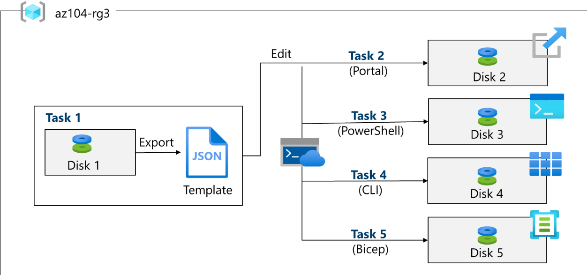

The lab demonstrates the creation and deployment of Azure Managed Disks through different Azure Resource Manager automation approaches.

---

## 🎯 Objectives

By completing this lab, I practiced:

* Creating an Azure Resource Manager template.
* Exporting an ARM template from an existing Azure resource.
* Editing and redeploying an ARM template.
* Using Azure Cloud Shell with PowerShell.
* Deploying ARM templates using Azure PowerShell.
* Using Azure Cloud Shell with Bash.
* Deploying ARM templates using Azure CLI.
* Creating and deploying resources using Azure Bicep.
* Comparing different Infrastructure as Code deployment approaches.
* Validating deployed resources through the Azure portal and command-line tools.

---

## 🧪 Lab Environment

| Component                | Configuration      |
| ------------------------ | ------------------ |
| Cloud Platform           | Microsoft Azure    |
| Resource Group           | `az104-rg3`        |
| Primary Resource         | Azure Managed Disk |
| Region                   | East US            |
| Disk 1                   | `az104-disk1`      |
| Disk 2                   | `az104-disk2`      |
| Disk 3                   | `az104-disk3`      |
| Disk 4                   | `az104-disk4`      |
| Disk 5                   | `az104-disk5`      |
| Initial Performance      | Standard HDD       |
| Disk Size                | 32 GiB             |
| Template Format          | ARM JSON           |
| IaC Alternative          | Azure Bicep        |
| Command-line Environment | Azure Cloud Shell  |

---

# 📚 Tasks

## Task 1 — Create an Azure Resource Manager Template

The first task creates an Azure Managed Disk manually through the Azure portal and then exports the resource configuration as an ARM template.

### Resource Configuration

| Setting           | Value                                 |
| ----------------- | ------------------------------------- |
| Resource Group    | `az104-rg3`                           |
| Disk Name         | `az104-disk1`                         |
| Region            | East US                               |
| Availability Zone | No infrastructure redundancy required |
| Source Type       | None                                  |
| Performance       | Standard HDD                          |
| Size              | 32 GiB                                |

### Step 1 — Create the Managed Disk

A managed disk named `az104-disk1` was created through the Azure portal.

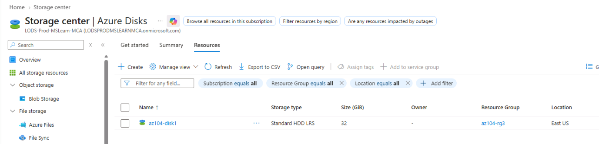

### Step 2 — Review the Disk

The managed disk configuration and resource properties were verified.

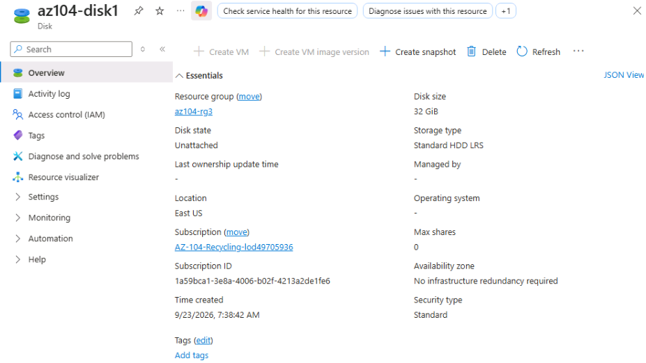

### Step 3 — Export the ARM Template

From the disk's **Automation** section, **Export template** was selected.


### Step 4 — Review the Template

The exported ARM template contains the Azure resource definition in JSON format.

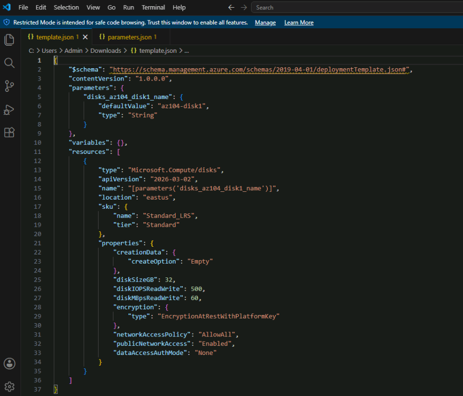

### Step 5 — Review Parameters

The exported parameters file contains configurable values used during deployment.

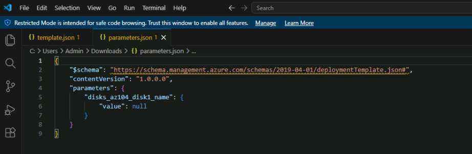

### Step 6 — Download the Template Files

Both `template.json` and `parameters.json` were downloaded for reuse in subsequent deployments.

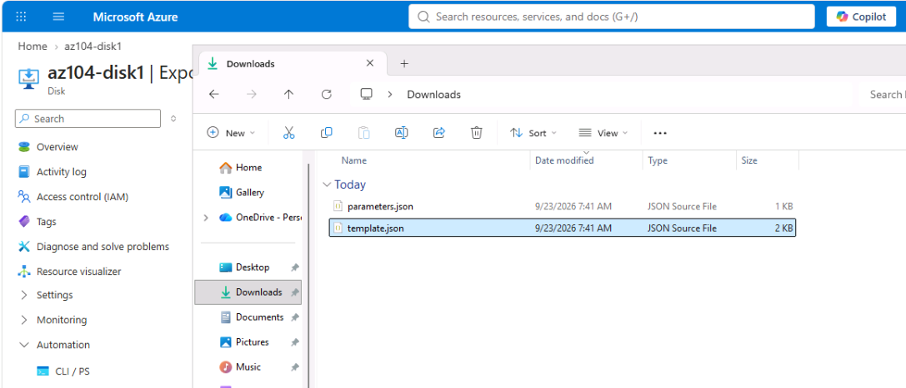

### Key Learning

Exporting an existing Azure resource provides a useful starting point for creating reusable Infrastructure as Code templates.

---

# Task 2 — Edit and Deploy an ARM Template using Azure Portal

In this task, the exported ARM template was modified and redeployed to create another managed disk.

### Step 1 — Open Custom Deployment

The Azure portal's custom deployment experience was used to deploy the ARM template.

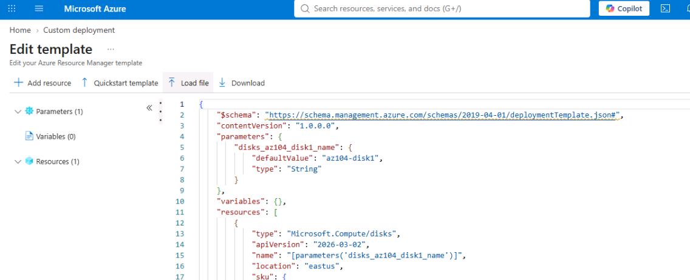

### Step 2 — Modify the ARM Template

The template was edited so that the new managed disk could be created with a different resource name.

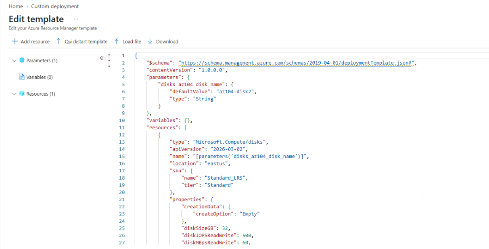

The disk name was changed to:

```text
az104-disk2
```

### Step 3 — Modify Parameters

The corresponding parameter values were updated before deployment.

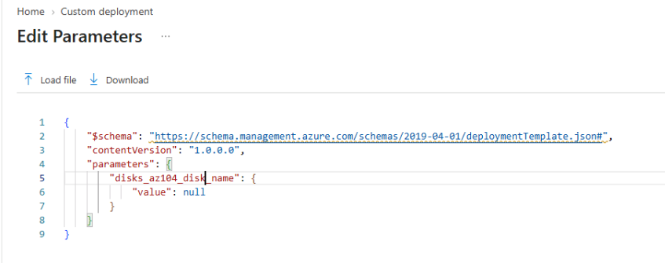

### Step 4 — Deploy the Template

The modified ARM template was deployed through the Azure portal.

### Step 5 — Verify the New Disk

The second managed disk was successfully created.

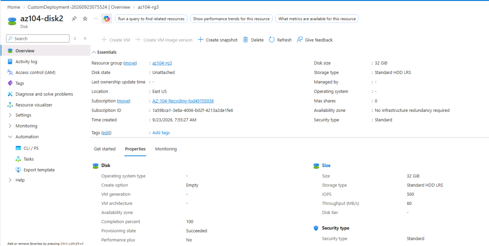

### Step 6 — Verify Resources

The resource group was checked to confirm that both managed disks were available.

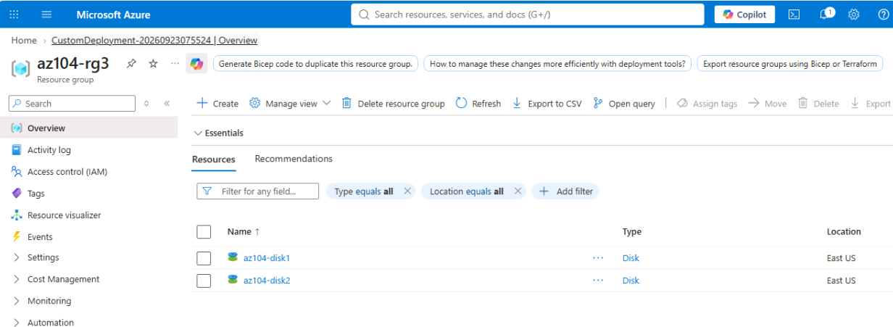

### Step 7 — Review Deployment History

Azure Resource Manager deployment history was reviewed to verify the completed deployment.

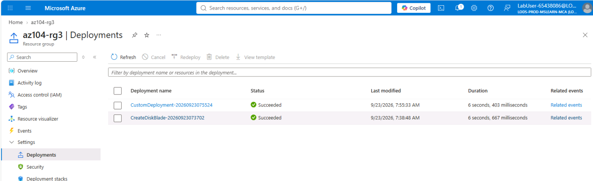

### Key Learning

ARM templates allow resource configurations to be reused and modified instead of manually recreating every Azure resource.

---

# Task 3 — Deploy an ARM Template using Azure PowerShell

This task demonstrates how the same ARM template can be deployed using **Azure PowerShell**.

## Step 1 — Open Cloud Shell

Azure Cloud Shell was opened and the PowerShell environment was selected.

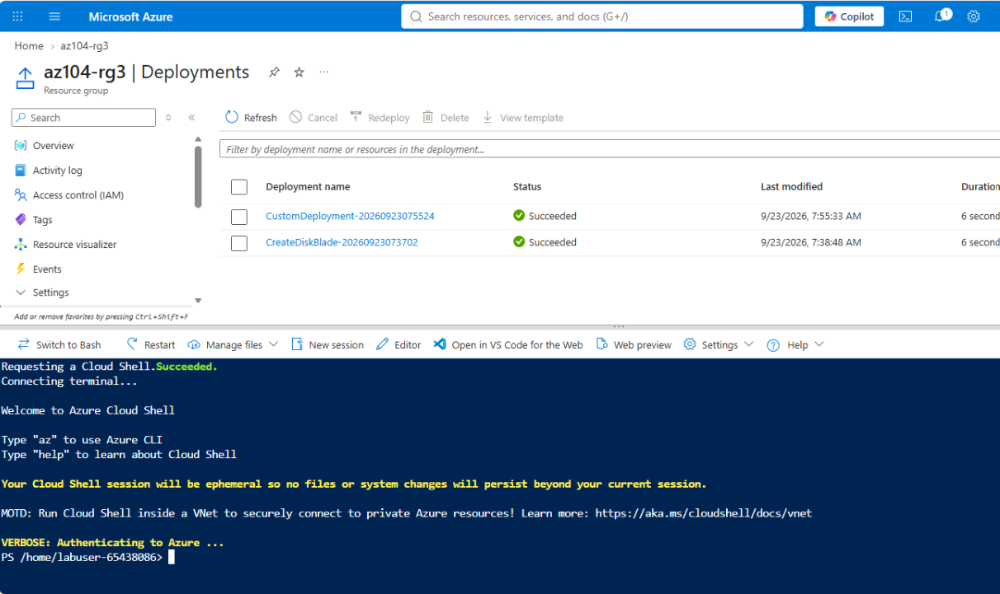

## Step 2 — Deploy the Template

The following Azure PowerShell command was used:

```powershell
New-AzResourceGroupDeployment `
    -ResourceGroupName az104-rg3 `
    -TemplateFile template.json `
    -TemplateParameterFile parameters.json
```

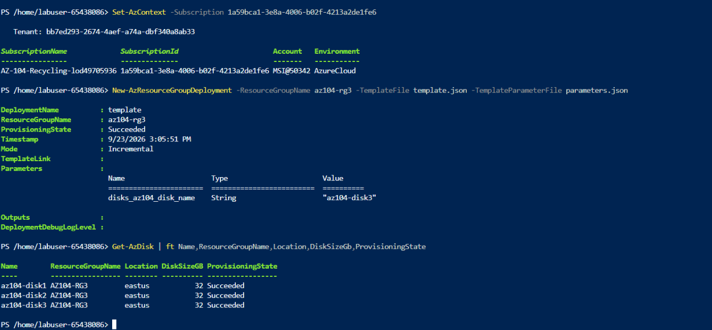

The deployment was verified as successful.

## Step 3 — Verify the Managed Disk

The resulting resource was checked using Azure PowerShell.

```powershell
Get-AzDisk | ft Name,ResourceGroupName,Location,DiskSizeGb,ProvisioningState
```

The third managed disk was successfully deployed.

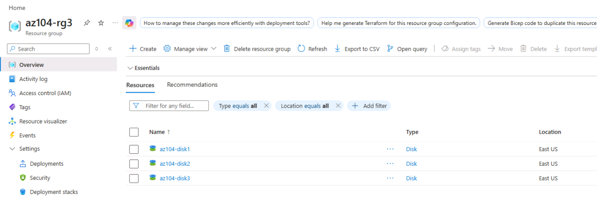

### Key Learning

Azure PowerShell provides a scripting-based method for deploying and managing Azure resources, which is useful for repeatable administration and automation.

---

# Task 4 — Deploy an ARM Template using Azure CLI

This task demonstrates deployment using the Azure CLI from an Azure Cloud Shell Bash session.

## Step 1 — Switch to Bash

Cloud Shell was switched from PowerShell to Bash.

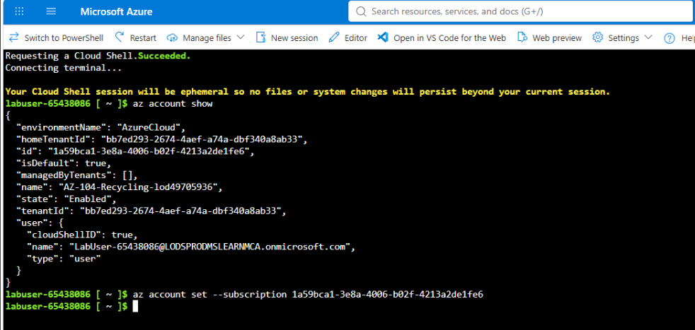

## Step 2 — Verify Subscription Context

The active Azure subscription can be verified with:

```bash
az account show
```

If required, the subscription can be changed using:

```bash
az account set --subscription <your-subscription-id>
```

## Step 3 — Modify the Template

The template was edited to create another managed disk:

```text
az104-disk4
```

## Step 4 — Deploy the Template

The following Azure CLI command was used:

```bash
az deployment group create \
    --resource-group az104-rg3 \
    --template-file template.json \
    --parameters parameters.json
```

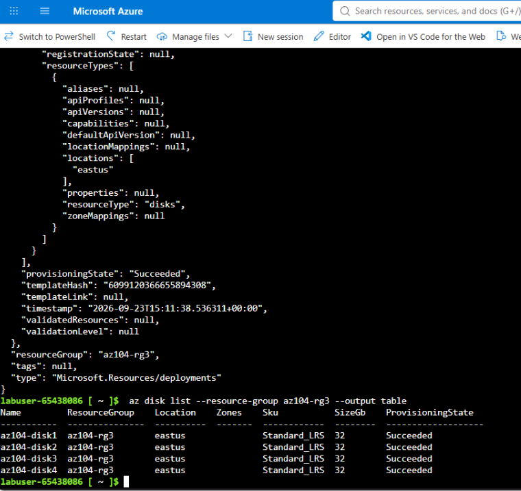

The deployment completed successfully.

## Step 5 — Verify the Disk

The deployed disk was verified using:

```bash
az disk list \
    --resource-group az104-rg3 \
    --output table
```

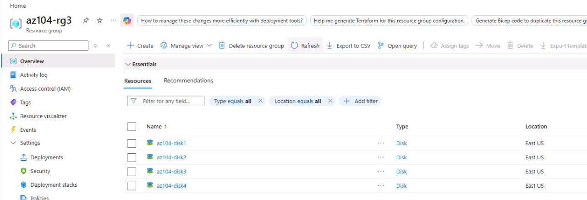

### Key Learning

Azure CLI provides a lightweight and scriptable approach for deploying Azure resources, particularly useful for automation and DevOps workflows.

---

# Task 5 — Deploy a Resource using Azure Bicep

The final task introduces **Azure Bicep**, a declarative Infrastructure as Code language designed for Azure deployments.

Bicep provides a more concise syntax for defining Azure resources while still deploying through Azure Resource Manager.

## Step 1 — Open the Bicep Template

The provided Bicep file was:

```text
azuredeploydisk.bicep
```

The template was uploaded to Azure Cloud Shell and opened using the Cloud Shell editor.

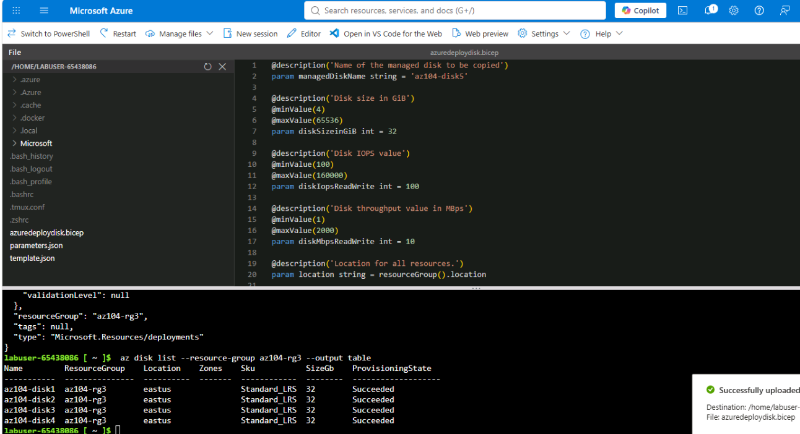

## Step 2 — Modify the Bicep Template

The following values were changed:

| Property          | Value             |
| ----------------- | ----------------- |
| `managedDiskName` | `az104-disk5`     |
| `diskSizeinGiB`   | `32`              |
| SKU               | `StandardSSD_LRS` |

## Step 3 — Deploy the Bicep Template

The following Azure CLI command was used:

```bash
az deployment group create \
    --resource-group az104-rg3 \
    --template-file azuredeploydisk.bicep
```

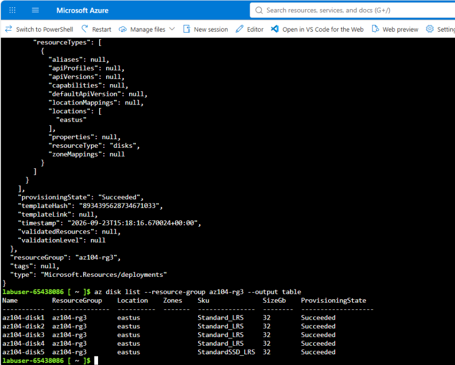

## Step 4 — Verify the Resource

The managed disks were listed to confirm the deployment:

```bash
az disk list \
    --resource-group az104-rg3 \
    --output table
```

The fifth managed disk was successfully created.

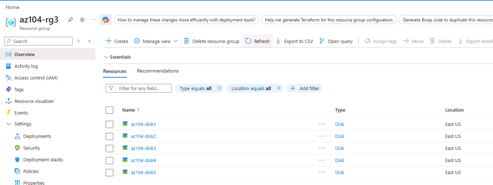

### Key Learning

Bicep provides a simplified way to define Azure resources compared with raw ARM JSON templates while remaining integrated with Azure Resource Manager.

---

# 🔄 Deployment Methods Demonstrated

This lab demonstrates five different ways of creating managed disks:

| Disk          | Deployment Method                          | Tool              |
| ------------- | ------------------------------------------ | ----------------- |
| `az104-disk1` | Manual resource creation + template export | Azure Portal      |
| `az104-disk2` | ARM template redeployment                  | Azure Portal      |
| `az104-disk3` | ARM template deployment                    | Azure PowerShell  |
| `az104-disk4` | ARM template deployment                    | Azure CLI         |
| `az104-disk5` | Bicep deployment                           | Azure CLI + Bicep |

This progression demonstrates how Azure resource deployment can move from manual configuration toward repeatable Infrastructure as Code workflows.

---

# 🧠 Key Concepts

## Azure Resource Manager Templates

ARM templates are JSON-based Infrastructure as Code definitions that describe Azure resources and their configuration.

They can be used to:

* Standardize deployments.
* Automate resource creation.
* Reuse infrastructure configurations.
* Reduce manual configuration.
* Improve deployment consistency.

## Azure PowerShell

Azure PowerShell provides PowerShell cmdlets for managing Azure resources.

Example:

```powershell
New-AzResourceGroupDeployment
```

## Azure CLI

Azure CLI provides command-line commands for Azure resource management.

Example:

```bash
az deployment group create
```

## Azure Bicep

Bicep is a declarative language for deploying Azure resources through Azure Resource Manager.

Compared with raw ARM JSON, Bicep provides a more concise and readable infrastructure definition.

---

# 📸 Evidence

| Evidence              | Screenshot                              |
| --------------------- | --------------------------------------- |
| Lab Architecture      | `00-architecture-diagram.png`           |
| Managed Disk Creation | `01-managed-disk-created.png`           |
| ARM Template Export   | `03-export-template.png`                |
| ARM Template          | `04-arm-template-json.png`              |
| ARM Parameters        | `05-arm-parameters-json.png`            |
| Edited ARM Template   | `08-edited-arm-template.png`            |
| Disk 2 Deployment     | `10-disk2-created.png`                  |
| PowerShell Deployment | `14-powershell-template-deployment.png` |
| Disk 3 Deployment     | `15-disk3-created.png`                  |
| Azure CLI Deployment  | `17-cli-template-deployment.png`        |
| Disk 4 Deployment     | `18-disk4-created.png`                  |
| Bicep Template        | `19-bicep-template.png`                 |
| Bicep Deployment      | `20-bicep-deployment.png`               |
| Disk 5 Deployment     | `21-disk5-created.png`                  |

---

# 🛠️ Skills Demonstrated

### Azure Administration

* Azure Managed Disks
* Resource Groups
* Azure Resource Manager
* Azure Portal
* Azure Cloud Shell

### Infrastructure as Code

* ARM Templates
* ARM Parameters
* Template Export
* Template Modification
* Template Deployment
* Azure Bicep

### Automation & Scripting

* Azure PowerShell
* Azure CLI
* Bash
* PowerShell

### DevOps-Relevant Skills

* Infrastructure as Code
* Repeatable deployments
* Configuration consistency
* Deployment validation
* Cloud automation

---

# 📈 AZ-104 Skills Connection

This lab supports the following Azure Administrator skills:

| AZ-104 Area               | Practical Experience                       |
| ------------------------- | ------------------------------------------ |
| Azure Resource Management | Created and managed Azure resources        |
| Infrastructure Automation | Used ARM templates and Bicep               |
| Azure Portal              | Created, exported, and deployed resources  |
| PowerShell                | Deployed ARM templates                     |
| Azure CLI                 | Deployed ARM and Bicep templates           |
| Resource Validation       | Verified deployments and resource states   |
| Cloud Shell               | Used both PowerShell and Bash environments |

---

# 🔐 Security & Best Practices

When publishing Azure lab evidence to GitHub:

* Do not expose passwords or secrets.
* Do not upload access tokens.
* Avoid exposing sensitive tenant information where unnecessary.
* Review screenshots before publishing.
* Avoid publishing personal subscription identifiers if they are not required.
* Never commit credentials or `.env` files to the repository.

For portfolio demonstrations, resource names such as `az104-disk1` and `az104-rg3` can generally remain visible because they are lab resource identifiers rather than credentials.

---

# 🧹 Cleanup

If the lab was completed using a personal Azure subscription, the lab resources should be removed after completing the exercise to avoid unnecessary Azure costs.

The resource group can be deleted from the Azure portal or by using Azure CLI:

```bash
az group delete \
    --name az104-rg3
```

Alternatively, Azure PowerShell can be used:

```powershell
Remove-AzResourceGroup -Name az104-rg3
```

> **Note:** Do not delete resources if they are still required for other labs or coursework.

---

# 📁 Repository Structure

```text
04-manage-resources-with-arm-templates/
│
├── README.md
│
├── screenshots/
│   ├── 00-architecture-diagram.png
│   ├── 01-managed-disk-created.png
│   ├── 02-managed-disk-overview.png
│   ├── 03-export-template.png
│   ├── 04-arm-template-json.png
│   ├── 05-arm-parameters-json.png
│   ├── 06-template-files-downloaded.png
│   ├── 07-custom-deployment-template.png
│   ├── 08-edited-arm-template.png
│   ├── 09-edited-arm-parameters.png
│   ├── 10-disk2-created.png
│   ├── 11-resource-group-two-disks.png
│   ├── 12-deployment-history.png
│   ├── 13-cloud-shell-powershell.png
│   ├── 14-powershell-template-deployment.png
│   ├── 15-disk3-created.png
│   ├── 16-cloud-shell-bash.png
│   ├── 17-cli-template-deployment.png
│   ├── 18-disk4-created.png
│   ├── 19-bicep-template.png
│   ├── 20-bicep-deployment.png
│   └── 21-disk5-created.png
│
└── notes/
    ├── deployment-commands.md
    └── arm-vs-bicep.md
```

---

# 📖 References

* Microsoft Learn — AZ-104 Microsoft Azure Administrator
* Microsoft Official Curriculum — Lab 03: Manage Azure resources by using Azure Resource Manager Templates
* Azure Resource Manager Templates
* Azure Bicep
* Azure PowerShell
* Azure CLI

---

# 🏁 Lab Summary

This lab provided practical experience with Azure Infrastructure as Code by deploying managed disks through multiple deployment methods.

The lab progressed from manually creating a resource in the Azure portal to exporting and modifying an ARM template, deploying the template through Azure PowerShell and Azure CLI, and finally using Azure Bicep.

The completed lab demonstrates practical exposure to:

```text
Azure Portal
     │
     ▼
Managed Disk
     │
     ▼
Export ARM Template
     │
     ├──► Azure Portal
     │
     ├──► Azure PowerShell
     │
     ├──► Azure CLI
     │
     └──► Azure Bicep
```

This hands-on exercise strengthened practical understanding of **Azure Resource Manager, Infrastructure as Code, ARM templates, Bicep, Azure PowerShell, Azure CLI, and automated Azure resource deployment**.

---

## ✅ Lab Status

**Completed — All Tasks 1–5**

* [x] Task 1 — Create an Azure Resource Manager template
* [x] Task 2 — Edit and deploy an ARM template using Azure Portal
* [x] Task 3 — Deploy an ARM template using Azure PowerShell
* [x] Task 4 — Deploy an ARM template using Azure CLI
* [x] Task 5 — Deploy a resource using Azure Bicep
* [x] Deployment verification completed
* [x] Architecture diagram documented
* [x] Screenshots organized
* [x] GitHub documentation prepared
