# Lab 05 – Implement Virtual Networking

This lab focuses on implementing and securing virtual networking infrastructure in Microsoft Azure.

The lab covers Azure Virtual Networks, subnetting, ARM templates, Application Security Groups (ASGs), Network Security Groups (NSGs), and Azure DNS.

---

## 📌 Lab Overview

The organization is planning to implement virtual networks to support existing workloads while providing sufficient address space for future growth.

Two virtual networks are created:

* **CoreServicesVnet** – supports core organizational services.
* **ManufacturingVnet** – supports manufacturing systems and connected devices.

The lab also demonstrates how to secure network traffic using Application Security Groups and Network Security Groups and how to configure both public and private Azure DNS zones.

---

## 🎯 Objectives

By completing this lab, I learned how to:

* Create Azure Virtual Networks using the Azure Portal.
* Design IPv4 address spaces and subnets.
* Create virtual networks using ARM templates.
* Modify and deploy exported Azure Resource Manager templates.
* Create and configure Application Security Groups.
* Create and associate Network Security Groups with subnets.
* Configure inbound NSG security rules.
* Configure outbound NSG security rules.
* Create public Azure DNS zones.
* Create DNS A records.
* Validate DNS resolution using `nslookup`.
* Create private Azure DNS zones.
* Link private DNS zones to virtual networks.
* Create private DNS records.

---

## 🏗️ Architecture

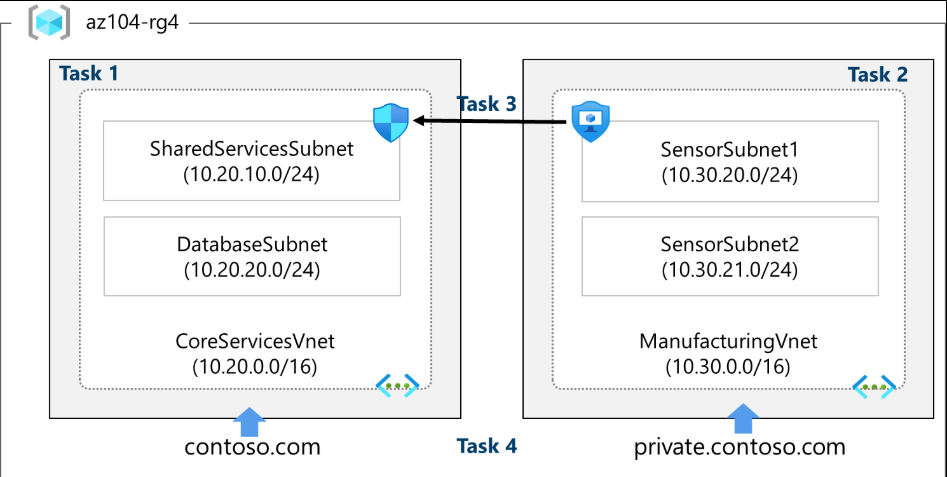

The lab architecture contains two virtual networks with dedicated address spaces and subnets.

### CoreServicesVnet

| Component              | Configuration   |
| ---------------------- | --------------- |
| Address Space          | `10.20.0.0/16`  |
| Shared Services Subnet | `10.20.10.0/24` |
| Database Subnet        | `10.20.20.0/24` |

### ManufacturingVnet

| Component       | Configuration   |
| --------------- | --------------- |
| Address Space   | `10.30.0.0/16`  |
| Sensor Subnet 1 | `10.30.20.0/24` |
| Sensor Subnet 2 | `10.30.21.0/24` |

---

# Task 1 – Create a Virtual Network with Subnets Using the Portal

## Objective

Create the `CoreServicesVnet` virtual network with a large address space and dedicated subnets to accommodate existing resources and future growth.

### Configuration

| Setting          | Value                  |
| ---------------- | ---------------------- |
| Resource Group   | `az104-rg4`            |
| Virtual Network  | `CoreServicesVnet`     |
| Region           | East US                |
| Address Space    | `10.20.0.0/16`         |
| Subnet 1         | `SharedServicesSubnet` |
| Subnet 1 Address | `10.20.10.0/24`        |
| Subnet 2         | `DatabaseSubnet`       |
| Subnet 2 Address | `10.20.20.0/24`        |

### 1. CoreServicesVnet Created

The CoreServicesVnet virtual network was successfully created in the `az104-rg4` resource group.

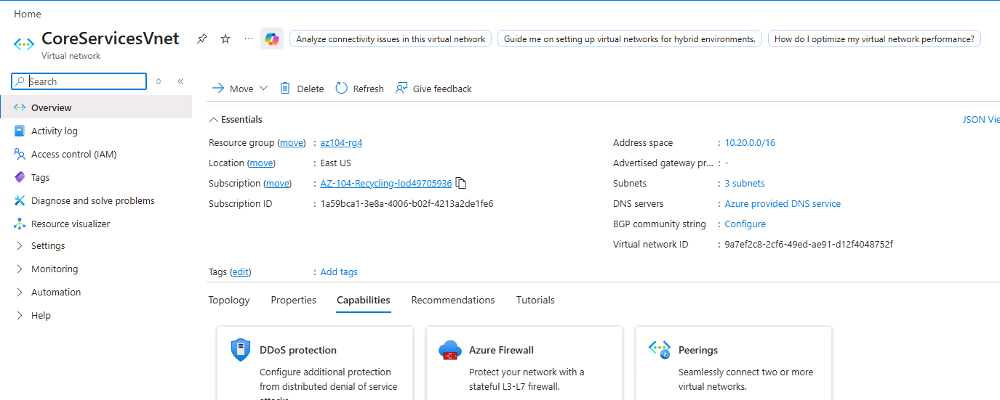

### 2. Configure Address Space

The VNet uses the `10.20.0.0/16` IPv4 address space.

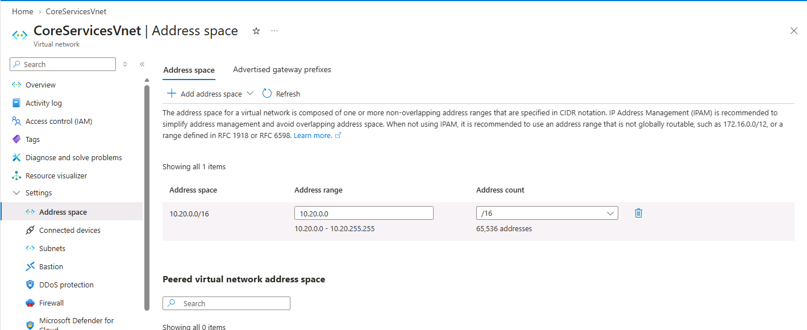

### 3. Configure Subnets

Two subnets were configured:

* `SharedServicesSubnet` – `10.20.10.0/24`
* `DatabaseSubnet` – `10.20.20.0/24`

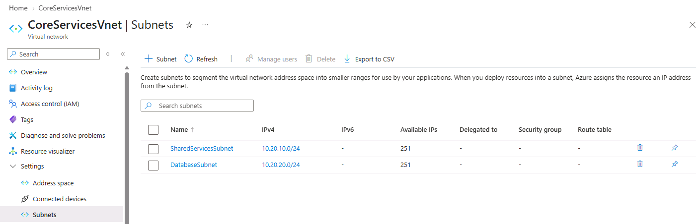

### 4. Verify Virtual Network

The final VNet configuration was verified from the Azure Portal.

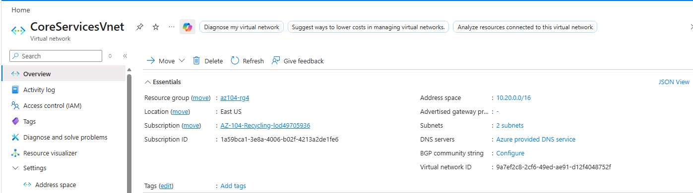

---

# Task 2 – Create a Virtual Network and Subnets Using a Template

## Objective

Use the exported ARM template from Task 1 as a starting point to create the `ManufacturingVnet`.

The exported template was modified instead of manually creating the second virtual network.

### 1. Export the CoreServicesVnet Template

The Azure Portal export template feature was used to generate the ARM template and parameter files.

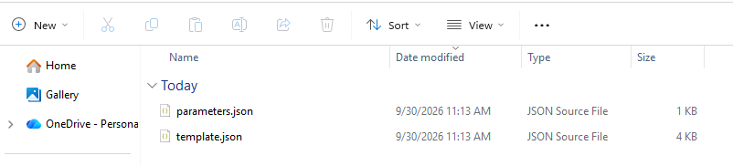

### 2. Review Template JSON

The exported `template.json` file was reviewed before making the required modifications.

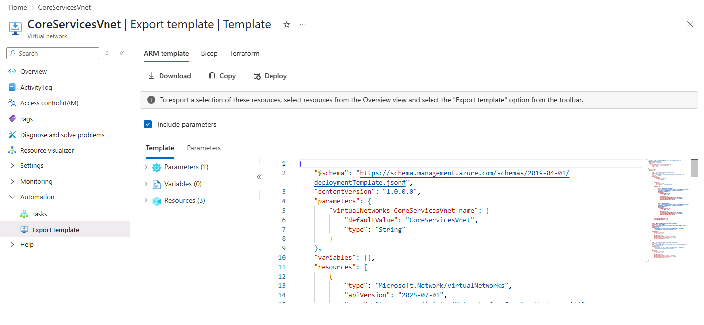

### 3. Review Parameters JSON

The exported `parameters.json` file was also reviewed.

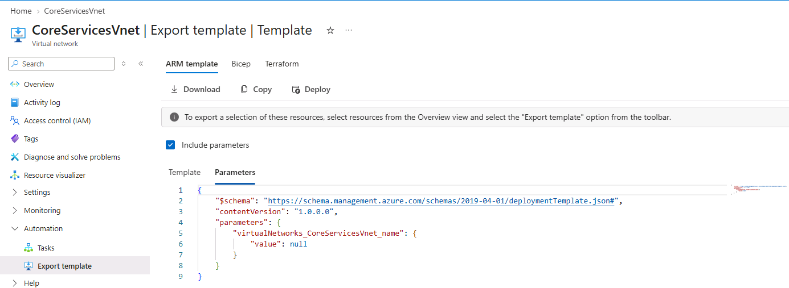

---

## ManufacturingVnet Template Changes

The following changes were made to the exported template.

| Original               | Modified            |
| ---------------------- | ------------------- |
| `CoreServicesVnet`     | `ManufacturingVnet` |
| `10.20.0.0`            | `10.30.0.0`         |
| `SharedServicesSubnet` | `SensorSubnet1`     |
| `10.20.10.0/24`        | `10.30.20.0/24`     |
| `DatabaseSubnet`       | `SensorSubnet2`     |
| `10.20.20.0/24`        | `10.30.21.0/24`     |

### 4. Modified Template

The template was modified to represent the Manufacturing virtual network and its sensor subnets.

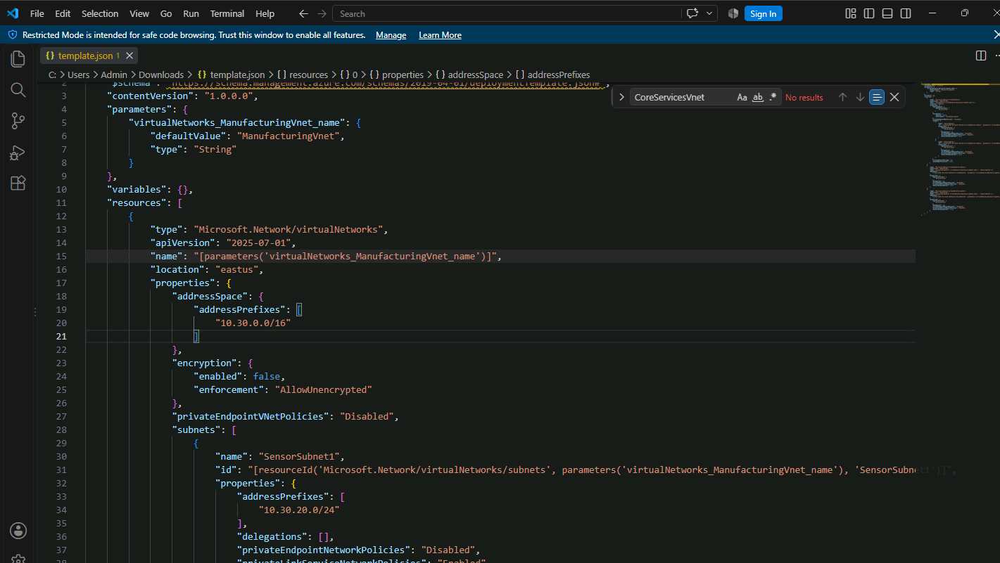

### 5. Modified Parameters

The parameter file was updated to reference `ManufacturingVnet`.

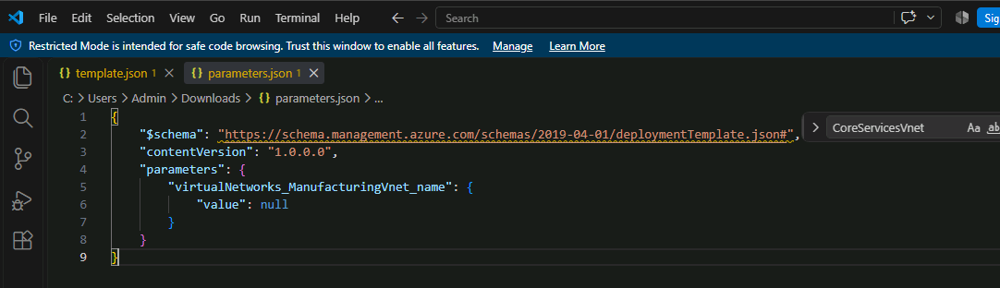

### 6. Deploy Custom Template

The modified template was uploaded through **Deploy a custom template** in the Azure Portal.

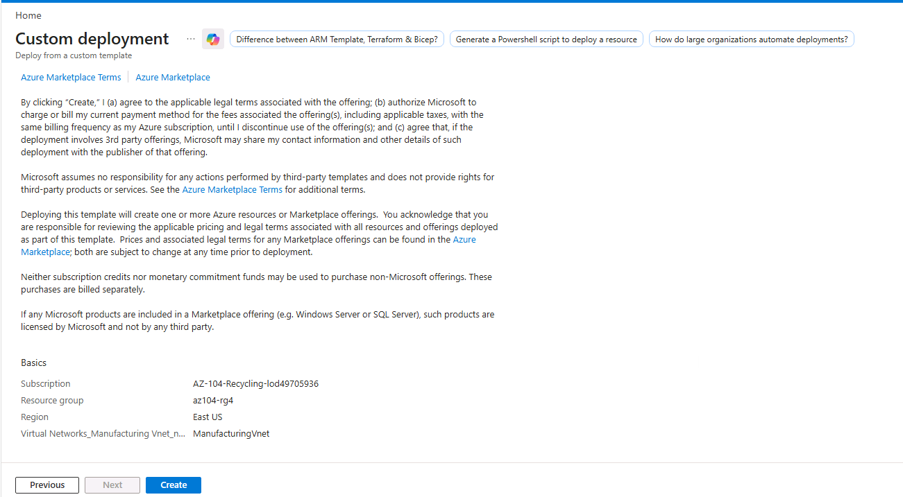

### 7. Verify ManufacturingVnet

The Manufacturing virtual network was successfully deployed.

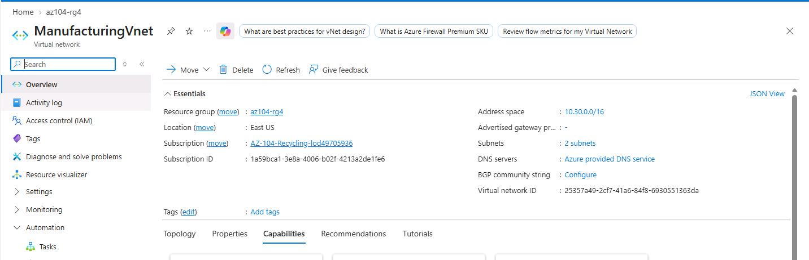

### 8. Verify Manufacturing Subnets

The following subnets were created:

* `SensorSubnet1` – `10.30.20.0/24`
* `SensorSubnet2` – `10.30.21.0/24`

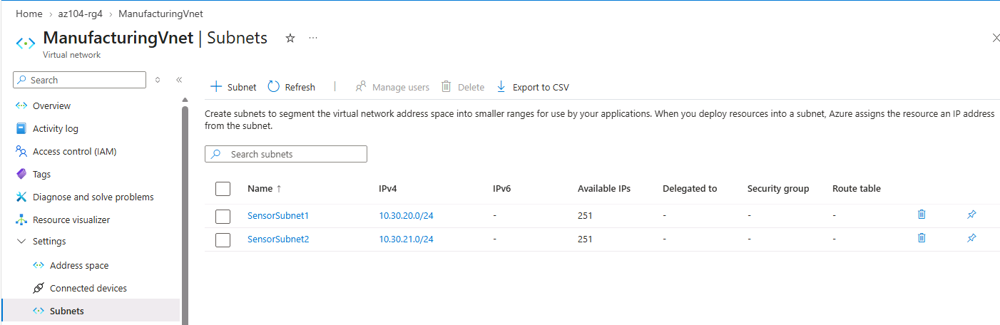

---

# Task 3 – Configure Communication Between an ASG and NSG

## Objective

Create an Application Security Group and Network Security Group and configure rules to control network traffic.

The configuration includes:

* An inbound rule allowing traffic from the Application Security Group.
* An outbound rule denying Internet access.

---

## Application Security Group

The Application Security Group `asg-web` was created in the `az104-rg4` resource group.

| Setting        | Value       |
| -------------- | ----------- |
| Name           | `asg-web`   |
| Resource Group | `az104-rg4` |
| Region         | East US     |

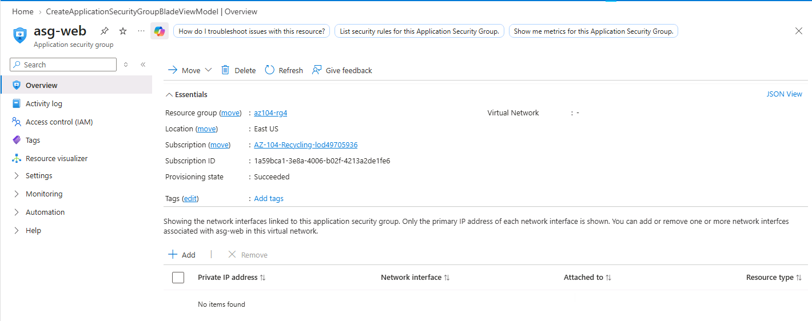

---

## Network Security Group

The Network Security Group `myNSGSecure` was created.

| Setting        | Value         |
| -------------- | ------------- |
| Name           | `myNSGSecure` |
| Resource Group | `az104-rg4`   |
| Region         | East US       |

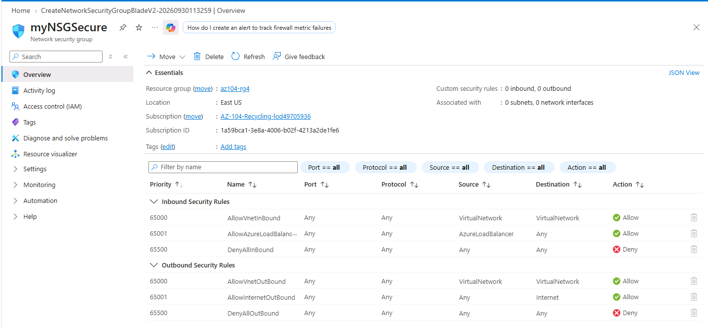

---

## NSG Subnet Association

The NSG was associated with:

* Virtual Network: `CoreServicesVnet`
* Subnet: `SharedServicesSubnet`

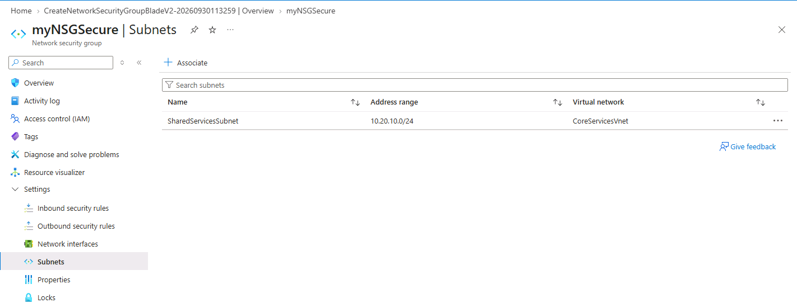

---

## Inbound Security Rule

An inbound security rule named `AllowASG` was created.

| Setting           | Value                      |
| ----------------- | -------------------------- |
| Source            | Application Security Group |
| Source ASG        | `asg-web`                  |
| Source Port       | `*`                        |
| Destination       | Any                        |
| Service           | Custom                     |
| Destination Ports | `80,443`                   |
| Protocol          | TCP                        |
| Action            | Allow                      |
| Priority          | `100`                      |
| Name              | `AllowASG`                 |

This rule allows HTTP and HTTPS traffic originating from resources associated with `asg-web`.

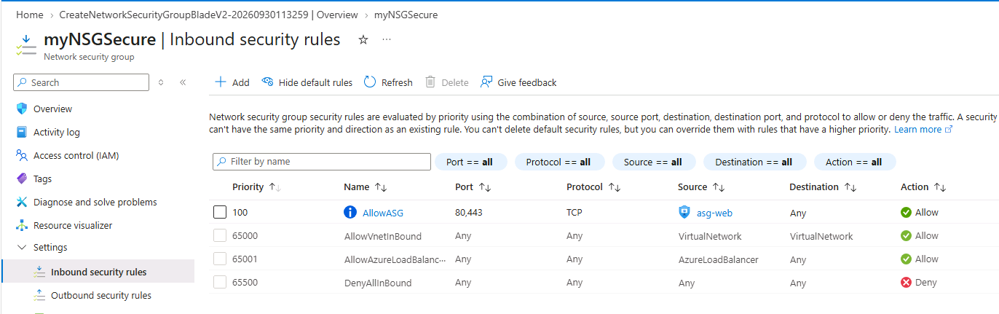

---

## Outbound Security Rule

An outbound rule named `DenyInternetOutbound` was created to deny Internet-bound traffic.

| Setting                 | Value                  |
| ----------------------- | ---------------------- |
| Source                  | Any                    |
| Source Port             | `*`                    |
| Destination             | Service Tag            |
| Destination Service Tag | Internet               |
| Service                 | Custom                 |
| Destination Port        | `*`                    |
| Protocol                | Any                    |
| Action                  | Deny                   |
| Priority                | `4096`                 |
| Name                    | `DenyInternetOutbound` |

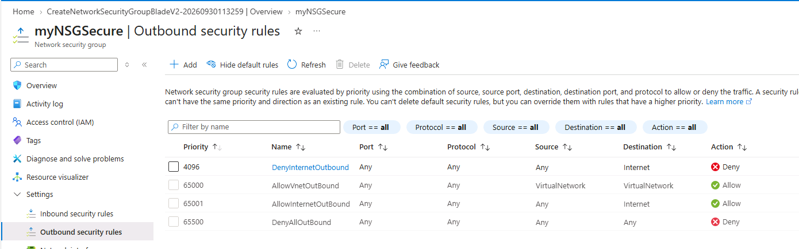

---

# Task 4 – Configure Public and Private Azure DNS Zones

## Objective

Configure Azure DNS for both public and private name resolution.

The public DNS configuration demonstrates Internet-facing DNS hosting, while the private DNS configuration provides name resolution within a linked Azure virtual network.

---

# Public DNS Zone

A public Azure DNS zone was created for the lab domain.

> **Note:** Azure requires a unique DNS zone name. Therefore, the actual domain name used during the lab may differ from the example `contoso.com`.

### DNS Zone

| Setting        | Value       |
| -------------- | ----------- |
| Resource Group | `az104-rg4` |
| Region         | East US     |
| Zone Type      | Public      |

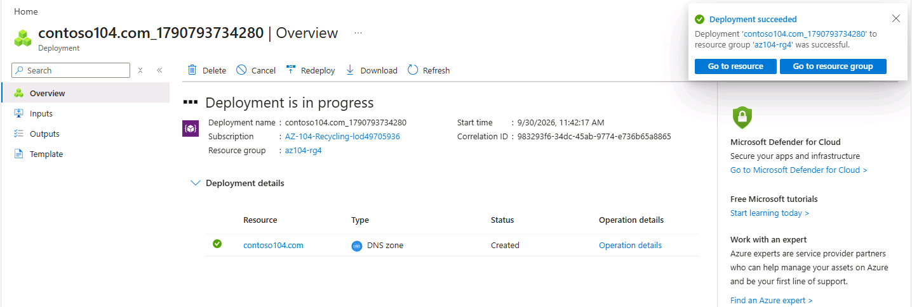

---

## DNS Name Servers

Azure automatically assigned four authoritative name servers to the DNS zone.

One of these name servers was copied for DNS resolution testing.

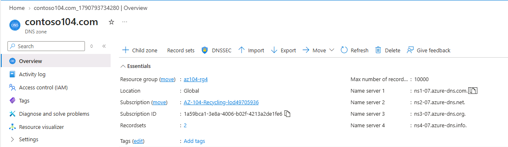

---

## Public A Record

An A record named `www` was created.

| Setting    | Value      |
| ---------- | ---------- |
| Name       | `www`      |
| Type       | A          |
| TTL        | `1`        |
| IP Address | `10.1.1.4` |

> In a real-world public DNS configuration, the A record would normally point to a public IP address.

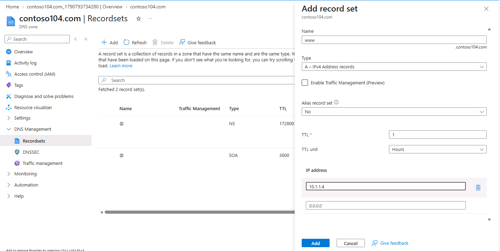

---

## DNS Resolution Test

The DNS record was tested using `nslookup`.

Example:

```bash
nslookup www.<your-domain> <azure-name-server>
```

The command was used to verify that the DNS name resolves to the configured IP address.

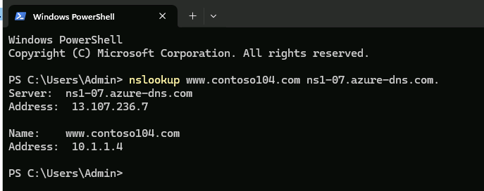

---

# Private DNS Zone

A private DNS zone was created for internal name resolution.

| Setting        | Value                  |
| -------------- | ---------------------- |
| Resource Group | `az104-rg4`            |
| Region         | East US                |
| Zone Name      | `private.contoso.com`* |

* The actual zone name may differ if a different public domain was selected during the lab.

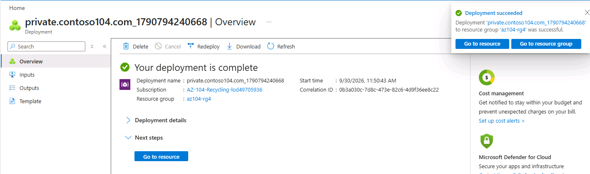

---

## Virtual Network Link

The private DNS zone was linked to `ManufacturingVnet`.

| Setting         | Value                |
| --------------- | -------------------- |
| Link Name       | `manufacturing-link` |
| Virtual Network | `ManufacturingVnet`  |

This allows resources inside the linked virtual network to use the private DNS zone for name resolution.

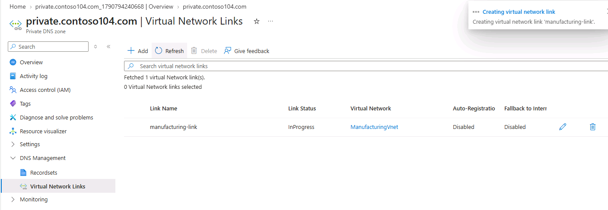

---

## Private DNS A Record

A private A record named `sensorvm` was created.

| Setting    | Value      |
| ---------- | ---------- |
| Name       | `sensorvm` |
| Type       | A          |
| TTL        | `1`        |
| IP Address | `10.1.1.4` |

> The IP address is a lab example. In a real environment, this would represent the private IP address of a manufacturing VM.

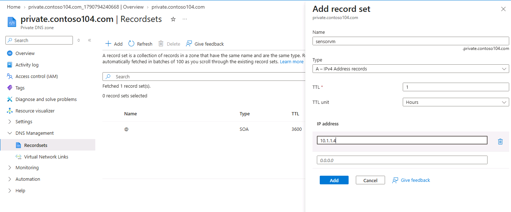

---

# Networking Concepts Learned

## Virtual Network

An Azure Virtual Network provides an isolated networking environment for Azure resources.

Example:

```text
CoreServicesVnet
└── 10.20.0.0/16
```

---

## Subnetting

A virtual network can be divided into multiple subnets.

```text
CoreServicesVnet
10.20.0.0/16
│
├── SharedServicesSubnet
│   └── 10.20.10.0/24
│
└── DatabaseSubnet
    └── 10.20.20.0/24
```

Subnetting helps organize workloads and provides a foundation for network security and routing.

---

## Application Security Group

An Application Security Group allows network security rules to be defined based on application roles rather than individual IP addresses.

Example:

```text
asg-web
   │
   ▼
HTTP / HTTPS
80 / 443
   │
   ▼
NSG Rule
AllowASG
```

---

## Network Security Group

An NSG contains inbound and outbound security rules that allow or deny network traffic.

Example:

```text
Inbound
asg-web
   │
   ├── TCP 80
   └── TCP 443
          │
          ▼
        Allow

Outbound
Internet
   │
   ▼
DenyInternetOutbound
```

---

## Public DNS

Public Azure DNS zones provide DNS hosting for publicly resolvable domains.

```text
www.example-domain.com
          │
          ▼
       A Record
          │
          ▼
       IP Address
```

---

## Private DNS

Private DNS zones provide DNS name resolution within linked Azure virtual networks.

```text
ManufacturingVnet
       │
       │ DNS Link
       ▼
private.contoso.com
       │
       ▼
sensorvm
```

---

# Important Commands

### DNS Resolution

```bash
nslookup www.<your-domain> <azure-name-server>
```

### Azure CLI – List Virtual Networks

```bash
az network vnet list \
  --resource-group az104-rg4 \
  --output table
```

### Azure CLI – Show VNet

```bash
az network vnet show \
  --resource-group az104-rg4 \
  --name CoreServicesVnet
```

### Azure CLI – List Subnets

```bash
az network vnet subnet list \
  --resource-group az104-rg4 \
  --vnet-name CoreServicesVnet \
  --output table
```

### Azure CLI – List NSGs

```bash
az network nsg list \
  --resource-group az104-rg4 \
  --output table
```

### Azure CLI – List DNS Zones

```bash
az network dns zone list \
  --resource-group az104-rg4 \
  --output table
```

### Azure CLI – Delete Lab Resource Group

```bash
az group delete \
  --name az104-rg4 \
  --yes
```

> The deletion command should only be used after confirming that the resource group contains no resources that need to be retained.

---

# Key Takeaways

Through this lab, I gained practical experience with Azure networking fundamentals.

### Virtual Networking

* Created Azure Virtual Networks.
* Designed IPv4 address spaces.
* Created and configured subnets.
* Planned address spaces with future growth in mind.
* Avoided overlapping address ranges.

### ARM Templates

* Exported an existing VNet configuration as an ARM template.
* Modified an exported template.
* Modified template parameters.
* Used a custom template deployment to create another VNet.

### Network Security

* Created an Application Security Group.
* Created a Network Security Group.
* Associated an NSG with a subnet.
* Configured inbound ASG-based security rules.
* Configured outbound Internet-deny rules.

### Azure DNS

* Created a public DNS zone.
* Configured a public A record.
* Verified DNS resolution using `nslookup`.
* Created a private DNS zone.
* Linked the private DNS zone to a virtual network.
* Created a private DNS A record.

---

# Lab Validation Checklist

* [x] CoreServicesVnet created
* [x] CoreServicesVnet address space configured
* [x] SharedServicesSubnet created
* [x] DatabaseSubnet created
* [x] CoreServicesVnet template exported
* [x] ManufacturingVnet template modified
* [x] ManufacturingVnet deployed using custom template
* [x] SensorSubnet1 created
* [x] SensorSubnet2 created
* [x] Application Security Group created
* [x] Network Security Group created
* [x] NSG associated with SharedServicesSubnet
* [x] ASG inbound rule configured
* [x] Internet outbound deny rule configured
* [x] Public DNS zone created
* [x] Public DNS A record created
* [x] DNS resolution tested
* [x] Private DNS zone created
* [x] ManufacturingVnet linked to private DNS
* [x] Private DNS A record created

---

# Repository Structure

```text
05-implement-virtual-networking/
│
├── README.md
│
├── screenshots/
│   ├── 00-architecture-diagram.png
│   ├── 01-core-services-vnet-created.png
│   ├── 02-core-services-address-space.png
│   ├── 03-core-services-subnets.png
│   ├── 04-core-services-vnet-overview.png
│   ├── 05-core-services-export-template.png
│   ├── 06-core-services-template-json.png
│   ├── 07-core-services-parameters-json.png
│   ├── 08-manufacturing-template-edited.png
│   ├── 09-manufacturing-parameters-edited.png
│   ├── 10-custom-template-deployment.png
│   ├── 11-manufacturing-vnet-created.png
│   ├── 12-manufacturing-vnet-subnets.png
│   ├── 13-application-security-group-created.png
│   ├── 14-network-security-group-created.png
│   ├── 15-nsg-subnet-association.png
│   ├── 16-allow-asg-inbound-rule.png
│   ├── 17-deny-internet-outbound-rule.png
│   ├── 18-public-dns-zone-created.png
│   ├── 19-public-dns-name-servers.png
│   ├── 20-public-dns-a-record.png
│   ├── 21-nslookup-dns-resolution.png
│   ├── 22-private-dns-zone-created.png
│   ├── 23-private-dns-vnet-link.png
│   └── 24-private-dns-a-record.png
│
└── notes/
    ├── networking-commands.md
    └── networking-concepts.md
```

---

## 🔗 Microsoft Learn Resources

* [Introduction to Azure Virtual Networks](https://learn.microsoft.com/training/modules/introduction-to-azure-virtual-networks/)
* [Secure and isolate access to Azure resources by using network security groups and service endpoints](https://learn.microsoft.com/training/modules/secure-and-isolate-with-nsg-and-service-endpoints/)
* [Host your domain on Azure DNS](https://learn.microsoft.com/training/modules/host-domain-azure-dns/)

---

## 🧹 Cleanup

If this lab was completed using a personal Azure subscription, remove the lab resource group after completing the documentation:

```bash
az group delete --name az104-rg4 --yes
```

This helps prevent unnecessary Azure resource consumption and charges.

---

## 📚 AZ-104 Skills Covered

**Microsoft Azure Administrator (AZ-104)**

* Virtual Networking
* IPv4 Addressing
* Subnetting
* ARM Templates
* Application Security Groups
* Network Security Groups
* Azure DNS
* Private DNS
* Network Security
* Azure CLI
* DNS Troubleshooting

# DNS Limitations and Considerations

Understanding the limitations of public and private DNS is important when designing Azure networking solutions.

## Public Azure DNS Limitations

Public Azure DNS is designed to host DNS zones that can be queried from the public Internet.

Key limitations and considerations:

* The DNS zone itself does **not automatically make an application publicly accessible**. The application still needs appropriate public connectivity, such as a public IP address or another public-facing service.
* DNS records only provide **name-to-IP or name-to-service resolution**; they do not provide network security.
* Azure DNS does not automatically register your domain with a domain registrar. The domain must be registered separately.
* For a delegated public domain, the domain registrar must be configured with the Azure DNS name servers.
* Public DNS records should generally point to publicly reachable endpoints. Using a private address such as `10.1.1.4` is suitable for the lab demonstration but is not a valid way to expose a private Azure resource to Internet users.
* DNS changes are subject to **TTL and DNS caching**, so changes may not appear immediately everywhere.
* Public DNS does not replace firewalls, NSGs, WAFs, or other network security controls.

### Example

```text
Internet User
      │
      ▼
www.example.com
      │
      ▼
Public Azure DNS
      │
      ▼
Public IP / Public Endpoint
      │
      ▼
Azure Application
```

---

## Private Azure DNS Limitations

Private Azure DNS is intended for name resolution within Azure virtual networks and connected private environments.

Key limitations and considerations:

* A private DNS zone is **not publicly resolvable from the Internet**.
* A private DNS zone must be linked to the appropriate virtual network before resources in that VNet can use the zone through Azure's private DNS integration.
* Resources in other VNets cannot automatically resolve records from the private zone unless the required VNet links or DNS architecture are configured.
* Private DNS provides **name resolution**, not network access. A successful DNS lookup does not mean that the destination resource is reachable.
* NSGs, Azure Firewall, routing, peering, VPN/ExpressRoute configuration, and other network controls can still prevent connectivity.
* Private DNS records do not automatically expose private resources to Internet users.
* DNS resolution across on-premises networks requires appropriate DNS forwarding/resolution architecture when using hybrid environments.
* Private DNS zones should be planned carefully when multiple VNets use the same namespace to avoid unexpected DNS resolution behavior.

### Example

```text
ManufacturingVnet
      │
      │ VNet Link
      ▼
private.contoso.com
      │
      ▼
sensorvm
      │
      ▼
Private IP
10.x.x.x
```

---

## Public vs Private DNS

| Feature                       | Public DNS                                        | Private DNS                            |
| ----------------------------- | ------------------------------------------------- | -------------------------------------- |
| Internet accessible           | Yes, for publicly delegated zones                 | No                                     |
| Main purpose                  | Public name resolution                            | Internal/private name resolution       |
| Requires VNet link            | No                                                | Yes, for Azure VNet-based resolution   |
| Public Internet clients       | Can query public DNS                              | Cannot directly query the private zone |
| Typical IP addresses          | Public endpoints                                  | Private IP addresses                   |
| Domain delegation             | Usually required for authoritative public hosting | Not publicly delegated                 |
| Provides network connectivity | No                                                | No                                     |
| Provides security by itself   | No                                                | No                                     |
| Typical use case              | Public websites and services                      | Internal applications and VMs          |

### Important Distinction

**DNS resolution and network connectivity are separate concepts.**

For example, if:

```text
sensorvm.private.contoso.com
        ↓
    10.1.1.4
```

resolves successfully, that only confirms that DNS returned an IP address. It does **not** prove that the client can connect to `10.1.1.4`.

Connectivity may still be affected by:

* NSG rules
* Route tables
* Azure Firewall
* Network peering
* VPN/ExpressRoute
* Application-level firewalls
* Service availability

This distinction is important when troubleshooting Azure networking issues.


## Public DNS Lab Example

The public DNS portion of this lab demonstrates how to create a public Azure DNS zone and configure an A record.

For the lab, an A record such as:

```text
www.<your-domain> → 10.1.1.4
```

was created.

### Important Note

`10.1.1.4` is a **private IPv4 address**. It is used here only as a lab example to demonstrate how an Azure DNS A record is configured.

A private IP address such as `10.1.1.4` is **not publicly routable over the Internet**. Therefore, this configuration does not make an application accessible from the Internet.

In a real public DNS deployment, the A record would normally point to the **public IP address of the application or service**, for example:

```text
Internet User
      │
      ▼
www.example.com
      │
      ▼
Azure Public DNS
      │
      ▼
Public IP Address
      │
      ▼
Public-facing Azure Service
```

### What This Lab Demonstrates

The lab verifies that:

1. A public DNS zone can be created in Azure.
2. An authoritative DNS record can be created.
3. An A record can contain the configured IP address.
4. Azure DNS name servers can be queried using `nslookup`.
5. DNS resolution is separate from network connectivity.

Therefore, successfully resolving:

```text
www.<your-domain> → 10.1.1.4
```

only demonstrates that the DNS record is configured and responding. It does **not** demonstrate that the IP address is reachable from the public Internet.

### Real-World Configuration

For a real public website, the configuration would normally look more like:

```text
www.example.com
        │
        ▼
Public Azure DNS
        │
        ▼
Public IP / Public Endpoint
        │
        ▼
Azure Application
```

The public DNS service provides **name resolution**, while network connectivity and security are handled separately using services such as public IPs, load balancers, Application Gateway, Azure Firewall, NSGs, and application-level controls as appropriate.
